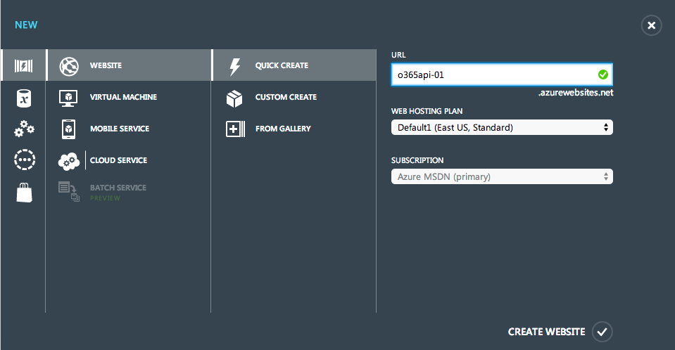
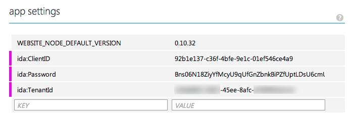
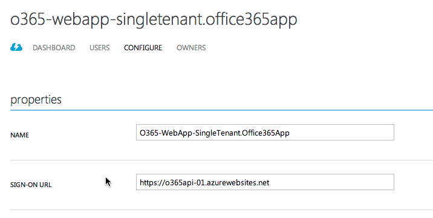
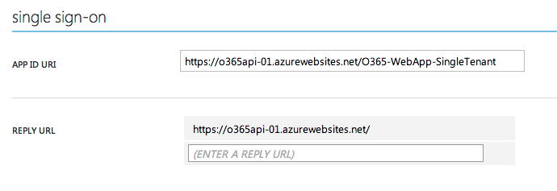
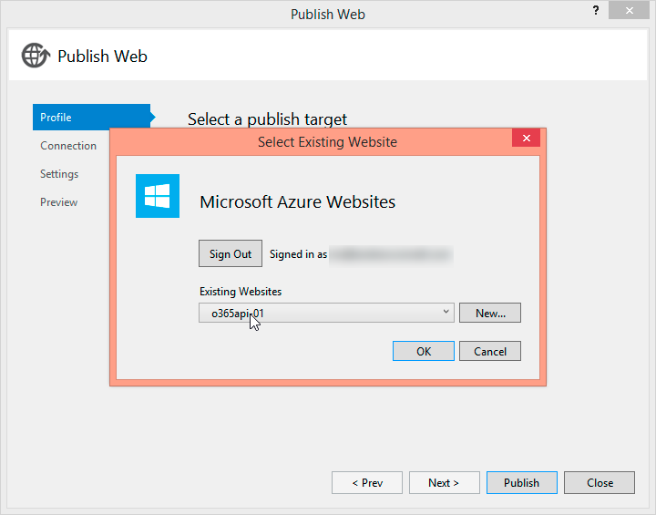
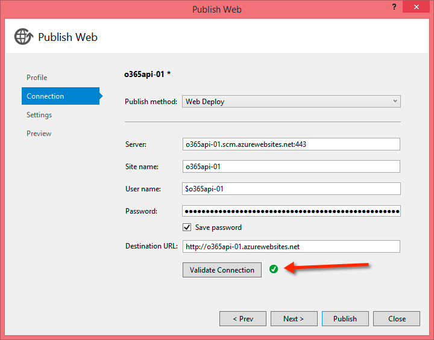

# Deploying Development Office 365 Sites to Microsoft Azure #

### Summary ###

When developing any type a web application, most development is done locally using http://localhost. Some projects use local resources or a mix of local and remote resources. Taking these projects from local development environments involves a handful of tasks to perform like changing database connection strings, URLs, configurations, etc.

Web projects that leverage the Office 365 APIs are no different. These projects leverage Microsoft's Azure AD service to authenticate the applications and obtain OAuth 2.0 access tokens. These tokens are used by the web applications to authenticate with the Office 365 APIs.

This page explains the steps involved in taking an Office 365 API development project and launching it to a working sample hosted entirely in Microsoft Azure using [Office 365](http://products.office.com/en-us/business/explore-office-365-for-business), [Azure Active Directory](http://azure.microsoft.com/en-us/services/active-directory/) & [Azure Websites](http://azure.microsoft.com/en-us/services/websites/.

Deploying an Office 365 API web application to Microsoft Azure from a local development environment requires three high-level steps to be performed as outlined in this page:

- [Create and Configure an Azure Website](#create-and-configure-an-azure-website)
- [Configure the Azure AD Application](#configure-the-azure-ad-application)
- [Configure the ASP.NET Project](#configure-the-aspnet-project)
- [Deploy the Office 365 API ASP.NET Web Application](#deploy-the-office-365-api-aspnet-web-application)

> This page assumes that you have a local working ASP.NET application that uses the Office 365 APIs. For reference, it will use the **[O365-WebApp-SingleTenant](https://github.com/OfficeDev/O365-WebApp-SingleTenant)** project found in the **[OfficeDev](https://github.com/OfficeDev)** account in GitHub.

# Create and Configure an Azure Website

In this step you will create an Azure website that will be used to host the web application. 

1. Navigate to the [Azure Management Portal](https://manage.windowsazure.com) and login using your Organization ID account.
1. After logging in, using the navigation sidebar, select **WEBSITES**.
1. On the **websites** page, click the **NEW** link in the footer found in the lower-left corner of the page.
1. In the wizard that appears, select **Quick Create**, enter a name for the site in the **URL** field, select a **Web Hosting Plan** and **Subscription**. 

  

  > Make sure to keep a note of the name of the website you create as it will be needed later.

1. Finally click the **Create Website** link to create the site.

Give Azure a few moments to create the site. After creating the site you can specify *app settings* through the web interface. This allows you to override any `<appSettings>` within the project's `web.config` file through the web administration interface for the website without deploying your site codebase for simple `web.config` changes.

1. Click the website that you just created within the **Azure Management Portal**.
1. CLick the **CONFIGURE** link in the top navigation.
1. Scroll down to the **App Settings** section and add three new entries:
  - **ida:ClientID**
  - **ida:Password** 
  - **ida:TenantID** 
1. Copy the corresponding values from the working project's `web.config` to these settings values in your Azure website as shown in the following figure:

  

1. In the footer, click the **SAVE** button to save your changes.

At this point the Azure website is setup and configured to host the Office 365 API web project that you will deploy in a later step.


[back to top](#deploying-development-office-365-sites-to-microsoft-azure)


# Configure the Azure AD Application

In this step you will modify the Azure AD application used in the development & testing of the Office 365 application.

1. Navigate to the [Azure Management Portal](https://manage.windowsazure.com) and login using your Organization ID account.
1. After logging in, using the navigation sidebar, select **ACTIVE DIRECTORY**.
1. On the **active directory** page, select the directory that is linked to your Office 365 tenant.
1. Next, click the **APPLICATIONS** item in the top navigation.
1. Within the **Properties** section, update the **SIGN-ON URL** to point to the default URL of the Azure Website you created. Take note to use the HTTPS endpoint that is provided with all Azure websites.

  

1. Within the **Single Sign-On** section, update the **App ID URI** to use the domain for the Azure website (shown in the following figure).
1. Next, update the **REPLY URL** so the only URL listed is the homepage of the Azure website:

  

1. In the footer, click the **SAVE** button to save your changes.

At this point, the Azure AD application used by the Office 365 API web project has been configured to work with the new Azure website.


[back to top](#deploying-development-office-365-sites-to-microsoft-azure)


# Configure the ASP.NET Project

In this step you will configure the ASP.NET project in your application to use the new Azure Website.

For the sample application used in the example for this guidance, no extra work is actually required. However the web application does contain the settings within the `web.config` file for the Azure AD application and Azure AD tenant used during development. Some developers may choose to use different Azure AD applications or even different Azure subscriptions for their development and production instances.

In a previous step outlined in this page, when you created the Azure website you set the app settings for the application that are typically found in the `web.config`. To ensure the web application receives these values from the Azure website configuration, it's recommended you replace the values within the `web.config` with placeholder values instead.

1. Open the project's `web.config` file.
1. Locate the app settings for the **ida:ClientID**, **ida:Password** and **ida:TenantId**.
1. Replace the values of these settings with a placeholder value:

  ````xml
  <add key="ida:TenantId" value="set-in-azure-website-config" />
  <add key="ida:ClientID" value="set-in-azure-website-config" />
  <add key="ida:Password" value="set-in-azure-website-config" />
  ````

1. Save you changes.

At this point the web application, Azure website & application in Azure AD are all configured correctly and ready to be deployed.


[back to top](#deploying-development-office-365-sites-to-microsoft-azure)


# Deploy the Office 365 API ASP.NET Web Application

In this step you will publish the Office 365 API web application to the Azure website. Once the site has been deployed you will test it to ensure everything works as desired.

> This step assumes you have he Microsoft [Azure SDK](http://azure.microsoft.com/en-us/downloads/), version 2.0 or higher, installed. 


## Deploy the ASP.NET Web Application

1. Open your Office 365 API web application in Visual Studio 2013.
1. Within the Solution Explorer tool window, right-click the project and select **Publish** start the **Publish Web** wizard.
1. On the **Profile** tab, select **Microsoft Azure Website**.

  At this point you will be prompted to login to your Azure subscription using your Organization ID.

1. After logging in, select the website that you created in a previous step from this page and click **OK**.

  

1. On the **Connection** tab, click the **Validate Connection** button to ensure the connection profile was successfully downloaded and applied.

  

1. Click the **Publish** button to publish the web application to the Azure website.

## Test the ASP.NET Web Application

After publishing the web application to the Azure website, Visual Studio will open a browser and navigate to the site's homepage. 

By default this is the HTTP endpoint. Recall from the previous step when you configured the Azure AD application that you set it to only accept sign ons from the HTTPS endpoint. Before you use the application update the url to point to the HTTPS endpoint.

1. In the browser, update the URL to go to the HTTPS homepage for the Azure website. In the example in this page, that is https://o365api-01.azurewebsites.net.
1. Click the **Sign In** link in the header at the top-right of the page. This will redirect you to the Azure AD sign on page.

  > If you get an error at this point, it's likely an issue with the three app settings you created for the Azure website. Go back and make sure the values are the correct values from the Azure AD tenant & application. You should see a URL that looks 

1. After successfully logging in, you will be redirected back to the homepage for the web application of the Azure website you created.

At this point you have successfully deployed your Office 365 API web application project to run in an Azure website.

[back to top](#deploying-development-office-365-sites-to-microsoft-azure)


----------

### Related links ###
-  [O365-WebApp-SingleTenant](https://github.com/OfficeDev/O365-WebApp-SingleTenant)

### Applies to ###
-  Office 365 Multi Tenant (MT)
-  Office 365 Dedicated (D)


### Version history ###
Version  | Date | Comments
---------| -----| --------
0.1  | January 2, 2015 | First draft


