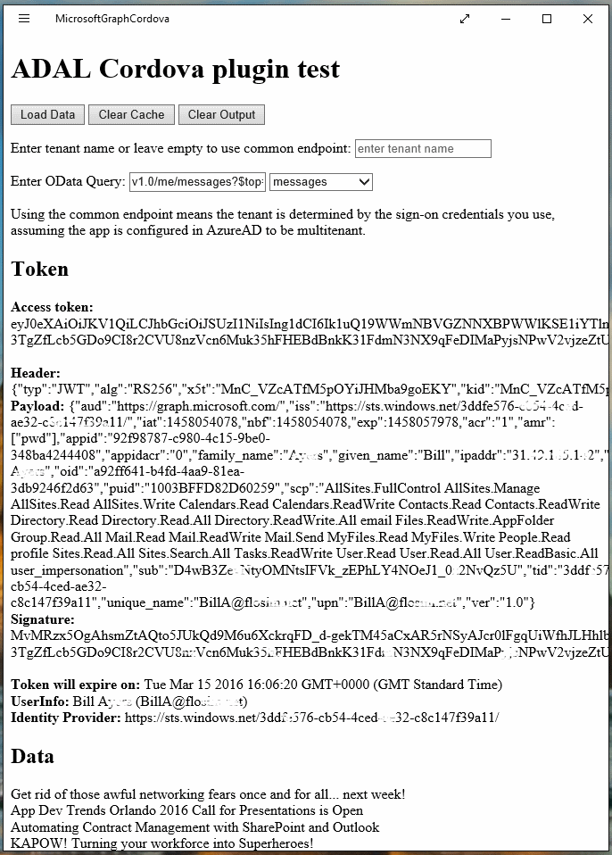

# Sample using Microsoft Graph with Apache Cordova and ADAL Cordova Plugin #

### Overview ###
This sample demonstrates how to use the Microsoft Graph API to retrieve data from 
Office 365 using the REST API and OData. The sample is intentionally simple and 
does not use any SPA frameworks,
data-binding library, jQuery, etc. It is not intended as a demonstration of a 
full-featured mobile app. You can target various Windows platforms as well as 
Android and iOS using the same JavaScript code.

The access token is obtained using the ADAL Cordova plugin. This is one of the 
core plugins in Visual Studio and is available from the config.xml editor.
This is an alternative to the Add Connected Service wizard that generates
a number of JavaScript files including a library (o365auth.js) that can be 
used to obtain tokens using an in-app browser to handle the user redirect 
to the authorization endpoint. Instead, the ADAL Cordova plugin uses the native
ADAL libraries for each platform and so is able to take advantage of native 
features such as token cacheing and hardened browsers.

### Applies to ###
-  Office 365 Multi Tenant (MT)
-  Microsoft Graph

### Prerequisites ###
- Visual Studio Tools for Apache Cordova (VS-TACO setup option)
- ADAL Cordova plugin (cordova-plugin-ms-adal)

### Solution ###
Solution | Author(s)
---------|----------
Mobile.MicrosoftGraphCordova | Bill Ayers (@SPDoctor, spdoctor.com, flosim.com)

### Version history ###
Version  | Date | Comments
---------| -----| --------
1.0  | March 15th 2016 | Initial release

### Disclaimer ###
**THIS CODE IS PROVIDED *AS IS* WITHOUT WARRANTY OF ANY KIND, EITHER EXPRESS OR IMPLIED, INCLUDING ANY IMPLIED WARRANTIES OF FITNESS FOR A PARTICULAR PURPOSE, MERCHANTABILITY, OR NON-INFRINGEMENT.**


----------

### Running the Sample ###

When the sample runs you can click on the "Load Data" button. If This 
is the first time you have run it you will be prompted to authorize
the application. This is the familiar Office 365 login prompt. Because we are using the 
Microsoft Graph it is also possible to use a "Microsoft Account" (i.e. live.com or hotmail 
account). 

If you entered your Office 365 tenant name it will work against this account. 
If you leave the tenant blank then the "Common" endpoint is used and the 
actual tenant used is determined from the user credentials used to authenticate 
with the authorization endpoint.

You can enter a valid query in the input box (although not all will be parsed
without code modification). Alternatively you can select from the dropdown box 
and select a pre-built query.



Once a token is obtained it is analysed and displayed for demo purposes only. 
The token is not encrypted (hence the need for transport-layer security like 
SSL) but should be treated as opaque, in other words do not write code that 
relies on information contained in the token - use the APIs instead.

Using the access token the REST request is made to the Microsoft Graph API and the data 
is displayed. You may notice a delay between the token being received and the 
data coming back from the REST endpoint. Note that the ADAL library can also
be used to obtain tokens for the original Office 365 REST endpoints, but in the
sample code the scope has been set to Microsoft Graph.

You can see that the access token has a lifetime of about one hour. You can 
continue to make further requests using the token until it expires without 
further prompts. This works even if you close the application and start it 
again because the token is cached. After an hour the token will expire 
and the refresh token is used to obtain a new access token. This also results 
in a new refresh token and this process can be repeated for several months 
as long as the refresh token, which is also cached, doesn't expire.

If you click on the "Clear Cache" button the token cache will be cleared.
The next time you click on Load Data you will get an authorization prompt. 

### Behind the Scenes ###

All the management of the cache (which is platform dependent), dealing with 
expired access tokens and using the refresh token, is handled by the ADAL 
libraries. You just have to obtain an Authentication Context and follow
the current recommended pattern which is to call acquireTokenSilentAsync first.
If a token can't be obtained silently (i.e. from the cache or by using a
refresh token), the "fail" callback then invokes acquireTokenAsync which has its
prompt behaviour set to "always".

```javascript

    context.acquireTokenSilentAsync(resourceUrl, appId).then(success, function () {
      context.acquireTokenAsync(resourceUrl, appId, redirectUrl).then(success, fail);
    });

```

Although the current documentation and some of the ADAL libraries have acquireTokenAsync 
with Prompt Behaviour set to "auto", which means prompt the user only if necessary, the 
design of the Cordova plugin is that acquireTokenAsync will always prompt. 

Note: I understand that the rest of the ADAL libraries will be adopting this pattern moving forward. 


