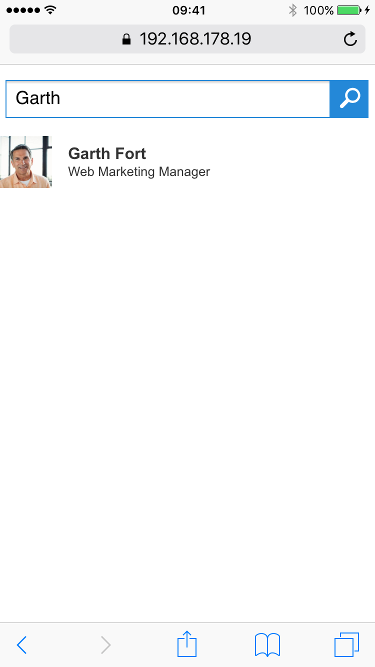
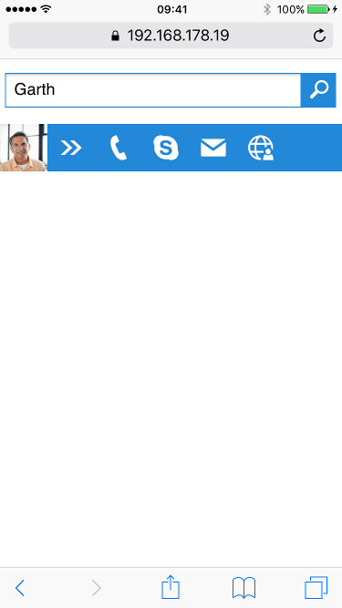
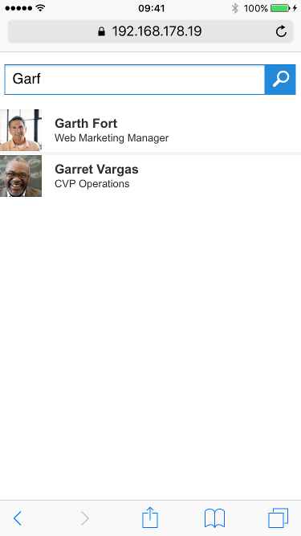
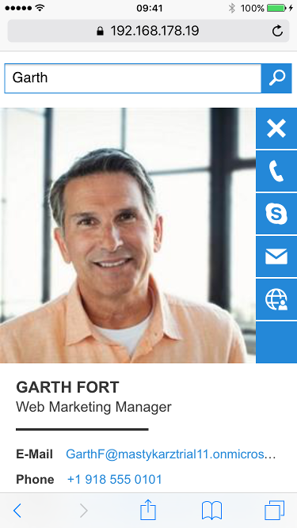
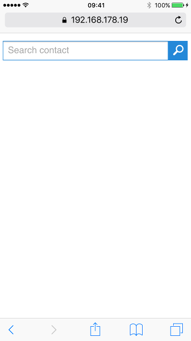

# Microsoft Graph - Quick Contacts

### Summary

This sample illustrates how you could use the Microsoft Graph to quickly find contacts on mobile devices.



### Applies to

- Office 365 Multi Tenant (MT)

### Prerequisites

- Office 365 tenant
- App configuration in Azure Active Directory (AAD)
    - Permissions
        - Office 365 SharePoint Online
            - Run search queries as user
        - Microsoft Graph
            - Read users' relevant people list (preview)
            - Access directory as the signed in user
            - Read all users' basic profiles
        - Windows Azure Active Directory
            - Sign in and read user profile
    - OAuth implicit flow enabled
    
### Solution

Solution|Author(s)
--------|---------
MicrosoftGraph.Office.QuickContacts|Waldek Mastykarz (MVP, Rencore, @waldekm), Stefan Bauer (n8d, @StfBauer)

### Version history

Version|Date|Comments
-------|----|--------
1.0|March 24th 2016|Initial release

### Disclaimer
**THIS CODE IS PROVIDED *AS IS* WITHOUT WARRANTY OF ANY KIND, EITHER EXPRESS OR IMPLIED, INCLUDING ANY IMPLIED WARRANTIES OF FITNESS FOR A PARTICULAR PURPOSE, MERCHANTABILITY, OR NON-INFRINGEMENT.**

---

## Office Quick Contacts

This is a sample application illustrating how you could leverage Microsoft Graph to quickly find relevant contacts using your mobile phone.


Using the new People API the application allows you to find contacts including their contact information.



Because the new People API uses phonetic search it doesn't matter if you don't spell the name of the person you're looking for correctly.



By tapping on a contact you can get access to additional information and if the contact is from your organization you will even get a direct link to their e-mail.



## Prerequisites

Before you can start this application, there are a few configuration steps that you need to complete.

### Configure Azure AD Application

This application uses Microsoft Graph to search for relevant contact. In order for it to be able to access Microsoft Graph, it has to have a corresponding Azure Active Directory application configured in your Azure Active Directory. Following are the steps to create and correctly configure the Application in AAD. 

- in Azure Active Directory create new web application
- set the **sign-on URL** to `https://localhost:8443`
- copy the **Client ID**, we will need it further on to configure the application
- in the **reply URL** add `https://localhost:8443`. If you want to test the application on your mobile device, you will also need to add the **External** URL displayed by browserify after starting the application using `$ gulp serve`
- grant your application the following permissions:
    - Office 365 SharePoint Online
        - Run search queries as user
    - Microsoft Graph
        - Read users' relevant people list (preview)
        - Access directory as the signed in user
        - Read all users' basic profiles
    - Windows Azure Active Directory
        - Sign in and read user profile
- enable OAuth implicit flow

### Configure the application

Before the application can be started, it needs to be linked to the newly created Azure Active Directory Application and a SharePoint tenant. Both settings can be configured in the `app/app.config.js` file.

- clone this repository
- as the value of the **appId** constant set the previously copied **Client Id** of the newly created AAD Application
- as the value of the **sharePointUrl** constant set the URL of your SharePoint tenant without the trailing slash, ie. `https://contoso.sharepoint.com`

## Running this application

Complete the following steps to start the application:

- in the command line execute
```
$ npm i && bower i
```
- in the command line execute
```
$ gulp serve
```
to start the application

 

