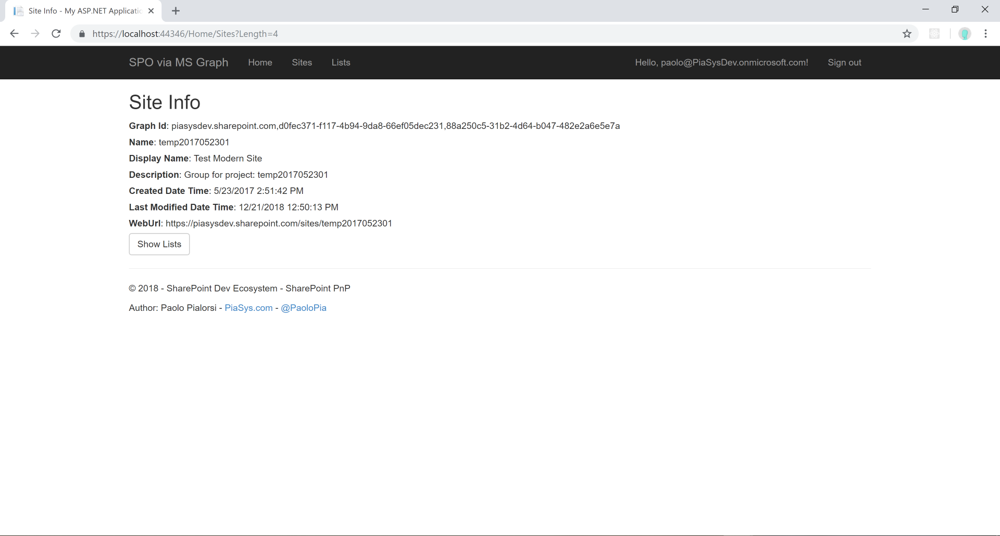
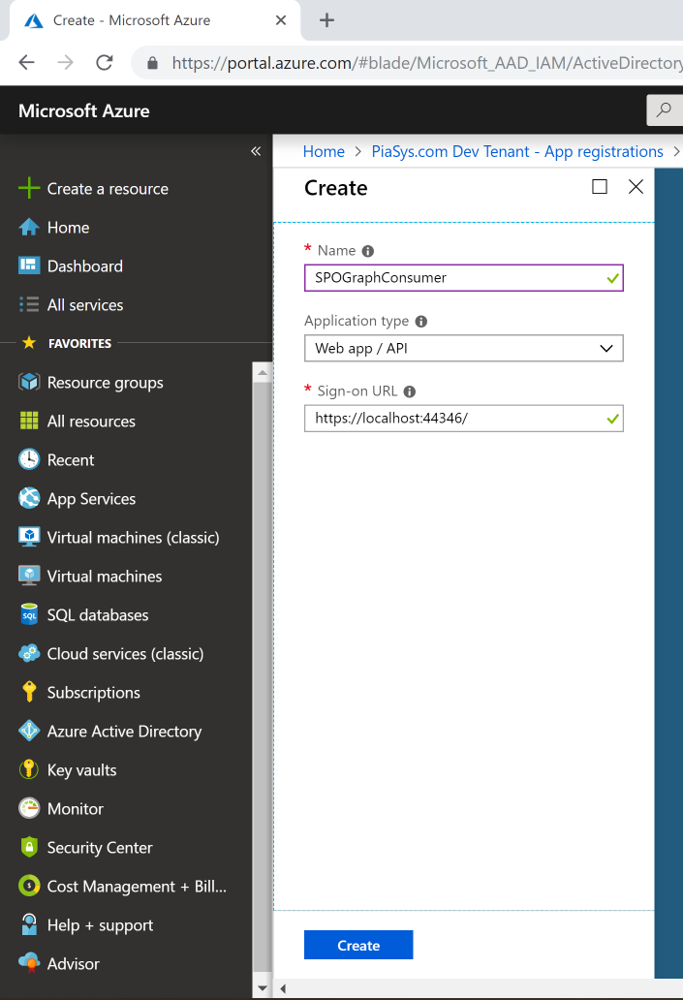
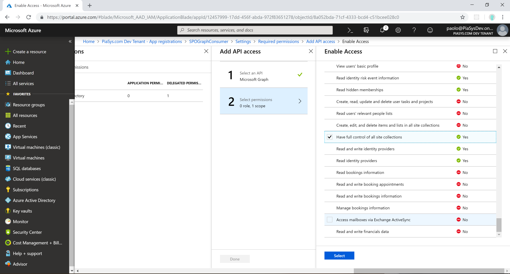
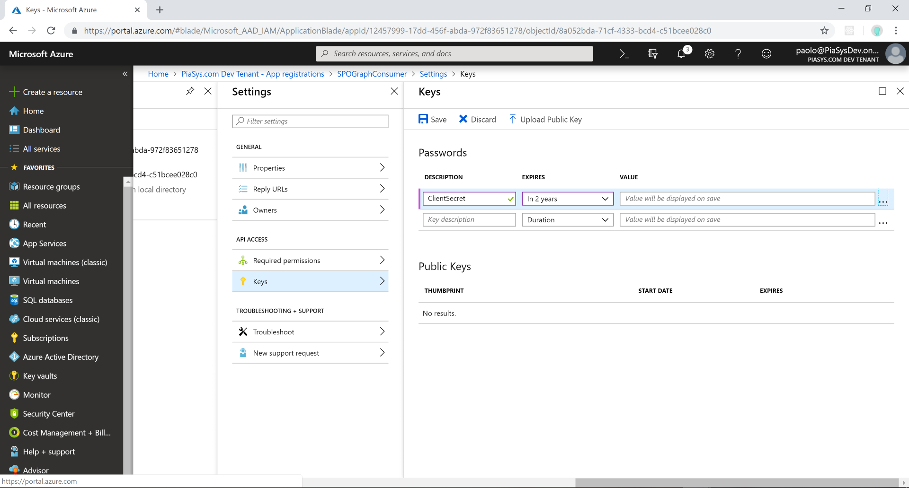
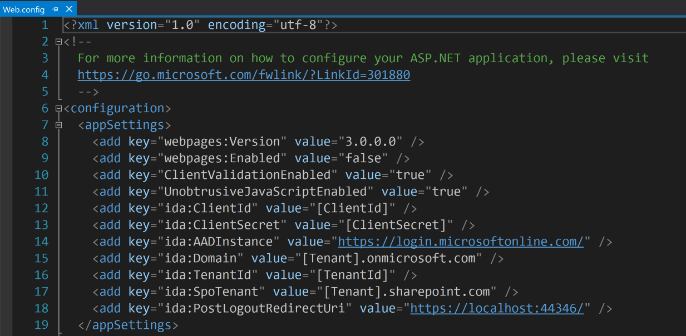

# Microsoft Graph - SharePoint Online Consumer #

### Summary ###
This is simplistic ASP.net MVC application to consume SharePoint Online using the Microsoft Graph.

### Applies to ###
- Office 365
- SharePoint Online

### Prerequisites ###
App configuration in the Azure AD

### Solution ###
Solution | Author(s)
---------|----------
SPOGraphConsumer | Paolo Pialorsi (PiaSys.com - @PaoloPia)

### Version history ###
Version  | Date | Comments
---------| -----| --------
1.0  | March 2018 | Initial release

### Disclaimer ###
**THIS CODE IS PROVIDED *AS IS* WITHOUT WARRANTY OF ANY KIND, EITHER EXPRESS OR IMPLIED, INCLUDING ANY IMPLIED WARRANTIES OF FITNESS FOR A PARTICULAR PURPOSE, MERCHANTABILITY, OR NON-INFRINGEMENT.**

----------

# Introduction #
This sample is demonstrating simplistic solution to consume SharePoint Online sites and lists using the *sites* endpoint of Microsoft Graph.

# Azure Active Directory Setup #
Before this sample can be executed, you will need to register application to Azure AD and provide needed permissions for the Graph queries to work. We will create an application entry in Azure Active Directory and configure the needed permissions.

- Open the [Azure Portal](https://portal.azure.com) and move to Azure Active Directory admin UI
- Move to **App Registrations** section
- Click **New application registration** to start the creation of a new app
- Configure a name for your app, select "Web app/API" for the *Application type*, and provide the URL of your app as it is declared in Visual Studio (for example: https://localhost:44346/)
- Click the *Create* button

- Now click on *Settings*, select *Required Permissions*
- Click *Add* and select the *Microsoft Graph* API
- Choose the *Delegated* permission for *"Have full control of all site collections"*
- Click *Select* and *Done*

- Now click on "Keys" and create a new key providing a unique name, a duration for the key (shorter duration is safer)
- Click on *Save* and copy the generated key in a safe place

You have now completed the the needed configuration at the Azure Active Directory part. Notice that you will need to still configure client id, client secret, and tenant settings in the web.config file of the project.

# Run the solution #
Whenever you have configured the Azure AD side and updated the web.config based on your environmental values, you can run the sample properly.

- Press F5 in the Visual Studio
- Login with your Office 365 account
- Press *Manage Sites* to query a target site

You can find further details about this sample application in the following video: [SharePoint PnP Webcast – Consuming SharePoint Online via the Microsoft Graph](https://developer.microsoft.com/en-us/office/blogs/consuming-sharepoint-online-via-the-microsoft-graph/)

