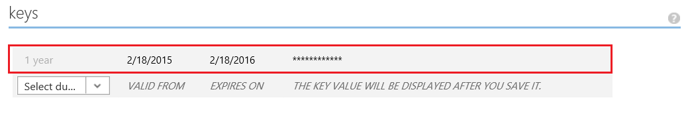
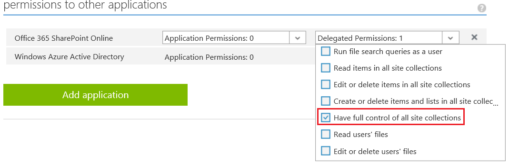
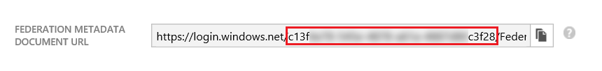
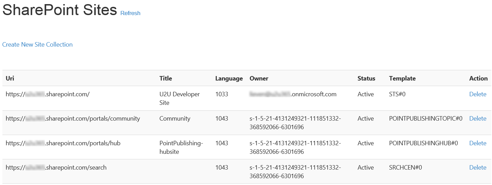
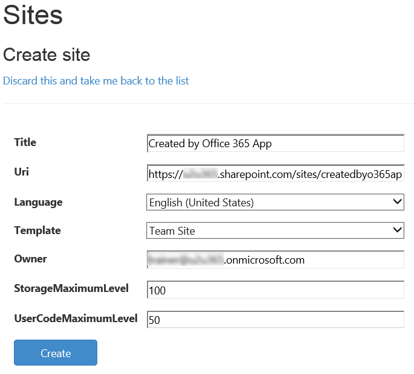

# Office 365 App for Site Collection Provisioning #

## Introduction ##
This solution is implemented as an Office 365 Web App and uses the Client Side Object Model (CSOM) to do Site Collection Provisioning.
When deciding to build an app that does site collection provisioning, you could chose to do this as a SharePoint App, but SharePoint Apps are typically contextual to the web they're hosted in. 
With the introduction of Office 365 Apps, which are contextual to the Office 365 tenant, provisioning site collections from an app seems more to be a task for an Office 365 App.

This project contains implementations for:
  - Get the available SharePoint Online Languages
  - Get the available SharePoint Online WebTemplates
  - Get an overview of all available SharePoint Online Site Collections
  - Create a new Site Collection
  - Delete an existing Site Collection

## Prerequisites and Configuration ##
This project requires the following:
  - Visual Studio 2013 with Update 3.
  - [Microsoft Office 365 API Tools version 1.3.41104.1](https://visualstudiogallery.msdn.microsoft.com/a15b85e6-69a7-4fdf-adda-a38066bb5155). 
  - An [Office 365 developer site](https://portal.office.com/Signup/Signup.aspx?OfferId=6881A1CB-F4EB-4db3-9F18-388898DAF510&DL=DEVELOPERPACK&ali=1).
  - A subscription to [Microsoft Azure](http://azure.microsoft.com/en-us/)
  - Microsoft IIS enabled on your computer.

### Configure the sample ###

Follow these steps to configure the sample.

   1. Open the Provisioning.Cloud.Management.sln file using Visual Studio 2013.
   2. Register and configure the app to consume Office 365 services (detailed below).
   3. Get your Office 365 tenant ID from Microsoft Azure (detailed below).

   Note: It is important to ensure the Office 365 API Tools are updated to the most recent version. Failure to do so may cause issues with running the sample. Again the most recent tools are located here: [Microsoft Office 365 API Tools version 1.3.41104.1](https://visualstudiogallery.msdn.microsoft.com/a15b85e6-69a7-4fdf-adda-a38066bb5155). 

### Register app to consume Office 365 APIs ###
  
  1. Go to the [Azure management portal] (https://manage.windowsazure.com/)
  2. Go to the application management in Azure Active Directory and add a new Web Application app. Provide http://localhost:37991/ as sign-on url, and provide the app id uri.
  3. Provide a key, make sure you save this key somewhere:

     

  4. Set permissions on SharePoint Online appliction:
     
     

### Change the web.config ###

Once you have your app registered in Azure Active Directory, you can make the changes to the web.config file.
Change the following settings:

  1. **ida:TenantID**: You can obtain this from Azure Active Directory. On your application page > Enable users to sign on:

     

  2. **ida:ClientID**: You can obtain this from the App configuration page in Azure Active Directory.

     

  3. **ida:Password**: The key you got when configuring the App.

     

  4. **ida:SharePointAdminResourceUri**: The SharePoint Online admin url: https://**<tenant>**-admin.sharepoint.com replacing **<tenant>** by your tenant name.

### Preview ###

