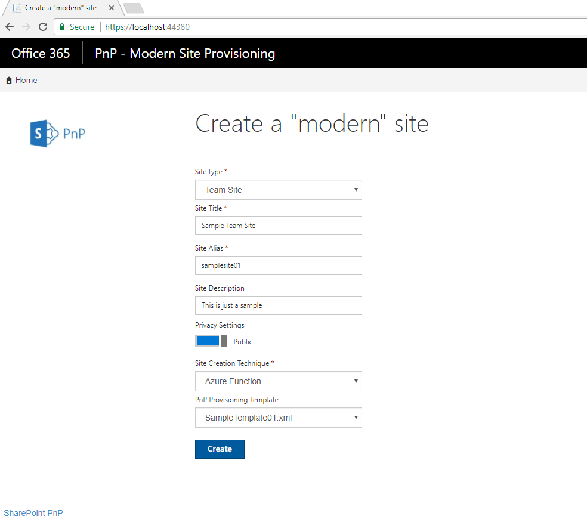
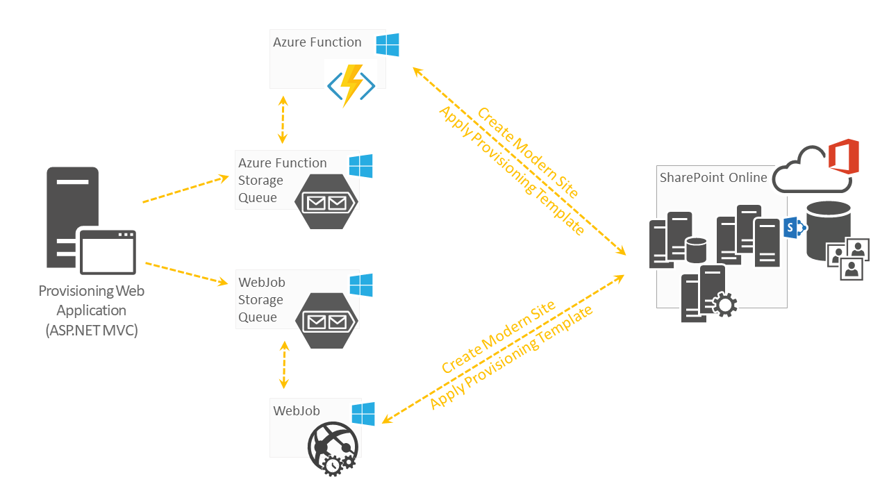
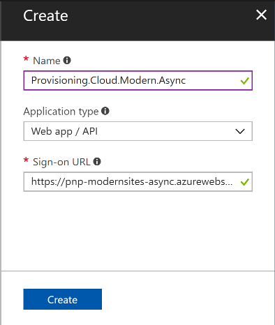
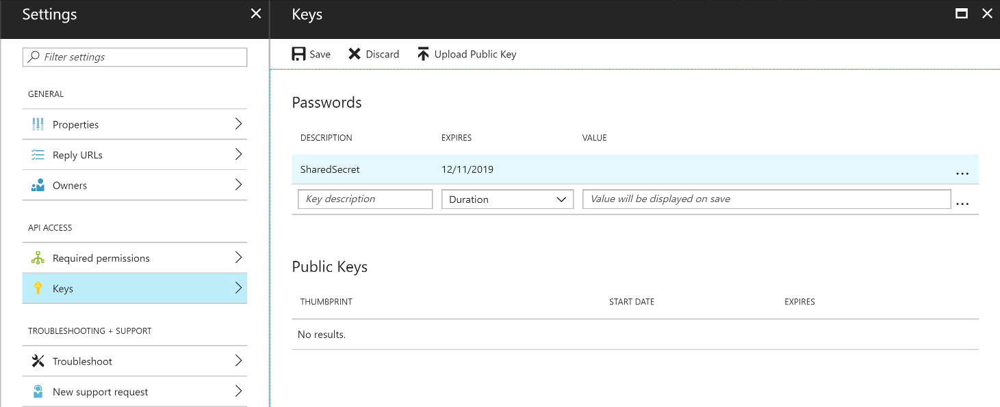
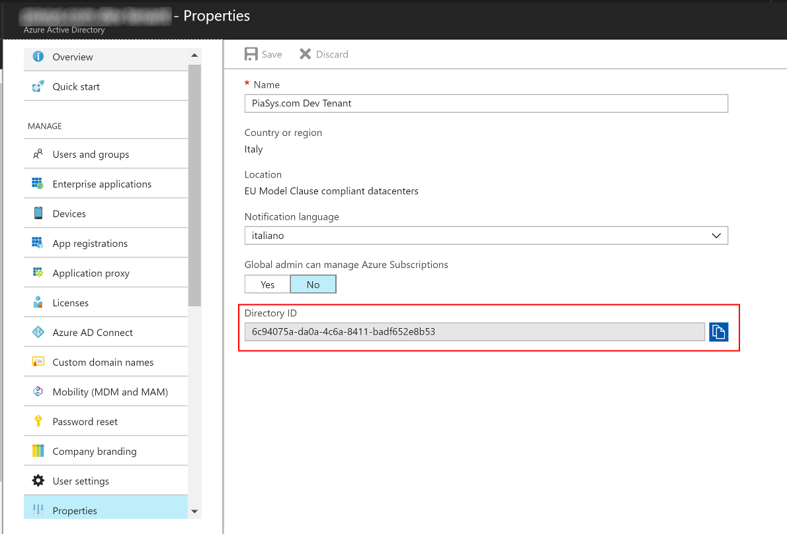

# Create "modern" site collections #

### Summary ###
This sample shows how to use SharePointPnP core component to create modern site collections and to apply a PnP Provisioning Template to them.

*Notice*: This sample uses [PnP Core Nuget package](https://github.com/SharePoint/PnP-Sites-Core) for the needed API operations.

### Applies to ###
-  Office 365 Multi Tenant (MT)

### Prerequisites ###
None

### Solution ###
Solution | Author(s)
---------|----------
Provisioning.Cloud.Modern.Async | Paolo Pialorsi (**[PiaSys.com](https://piasys.com/)** - [@PaoloPia](https://twitter.com/PaoloPia))

### Version history ###
Version  | Date | Comments
---------| -----| --------
1.0  | Nov 20th 2017 | Initial release

### Disclaimer ###
**THIS CODE IS PROVIDED *AS IS* WITHOUT WARRANTY OF ANY KIND, EITHER EXPRESS OR IMPLIED, INCLUDING ANY IMPLIED WARRANTIES OF FITNESS FOR A PARTICULAR PURPOSE, MERCHANTABILITY, OR NON-INFRINGEMENT.**

----------
# SCENARIO: Create a modern site using a custom asynchronous application #
This sample demonstrates how to create "modern" SharePoint Online site collections ("modern" Team sites and "modern" Communication sites) using an Office 365 application registered in Azure Active Directory. Moreover, right after the creation of the "modern" site, the solution applies a PnP Provisioning template to the site.

## Solution Architecture ##
The solution has a fully decoupled architecture, which uses a front-end ASP.NET MVC web site for the UI and a couple of background services to create the modern sites. In the following figure you can see an architectural schema of the solution.

For the sake of making a full example, the solution supports both an Azure Function and an Azure WebJob. They are fully interchangeable, and you can use this sample solution to see the differences and make your choice based on your functional requirements. Both the Azure Function and the Azure WebJob use an Azure Blob Storage Queue to store information about the "modern" sites to create. Through this approach the front-end application is fully decoupled from the back-end services, and you can benefit from a fully asynchronous and scalable architecture.
Notice that, for the sake of sharing an architectural pattern, the front-end application embeds and OAuth 2.0 Access Token into the blob storage queue message, to provide to the back-end service (whether it is an Azure Function or an Azure WebJob) the security context of the interactive user creating the site through the web-based UI.

## Solution Deployment ##
In order to deploy the solution you need to:
* Create an Azure App Service to host the web application
    * Save the name of the app service, because you will use it in the following steps
* Register the application in Azure AD:
    * Browse to: https://portal.azure.com/
    * Select "Azure Active Directory" -> "App Registrations" and click on "New application registration" in the upper command bar
    * Follow the wizard steps:
        * Provide a name for the application (for example Provisioning.Cloud.Modern.Async)
        * Choose "Web app/API" in the "Application type" field
        * Provide the URL of the Azure App Service for the "Sign-on URL" field

* Select the just created App
    * Save the "Application ID" (i.e. Client ID) of the just created app
    * Select "Keys" in the "Settings" panel
        * Create a new password, give it a name (for example "SharedSecret") and an expire date
        * Hit the "Save" button to read the generated password, and save the password value together with the Client ID

* Now, still in the "Settings" panel select "Required Permissions" and configure the following permissions:
    * Office 365 SharePoint Online (Microsoft.SharePoint)
        * Delegated Permissions
            * Read managed metadata
            * Have full control  of all site collections
    * Microsoft Graph
        * Delegated Permissions
            * Read and write directory data
    * Windows Azure Active Directory (Microsoft.Azure.ActiveDirectory)
        * Delegated Permissions
            * Sign in and read user profile

* Close the App and select the "Properties" section of the current Azure AD tenant
    * Copy the value of the "Directory ID" field, and store it as the TenantId value

* Select your target SharePoint Online environment and save the URL of the root site collection (the one like https://[your-tenant-name].sharepoint.com/), call it SPORootSiteUrl
* Update the web.config file of the web application (Provisioning.Cloud.Modern.Async) in order to target the ClientId, ClientSecret, Domain, TenantId and SPORootSiteUrl of your environment.
* Create an Azure Blob Storage Account (classic) and two Blob Storage Queues in there. One queue will be called "modernsitesazurefunction" and will be used by the Azure Function. Another queue will be called "modernsitesazurewebjob" and will be used by the Azure WebJob. 
* Configure the Azure Blob Storage Account connection string in both the Azure Function settings (Provisioning.Cloud.Modern.Async.Function) and  in the Azure WebJob settings (Provisioning.Cloud.Modern.Async.WebJob).
* Publish the ASP.NET MVC application (Provisioning.Cloud.Modern.Async) onto an Azure App Service, and configure proper settings in the "Application Settings" section of the App Service configuration.
* Publish the Azure Web Job (Provisioning.Cloud.Modern.Async.WebJob) within the same Azure App Service used in the  previous step.
* Publish the Azure Function (Provisioning.Cloud.Modern.Async.Function) targeting a new Azure Function, which you can create directly from Visual Studio.

