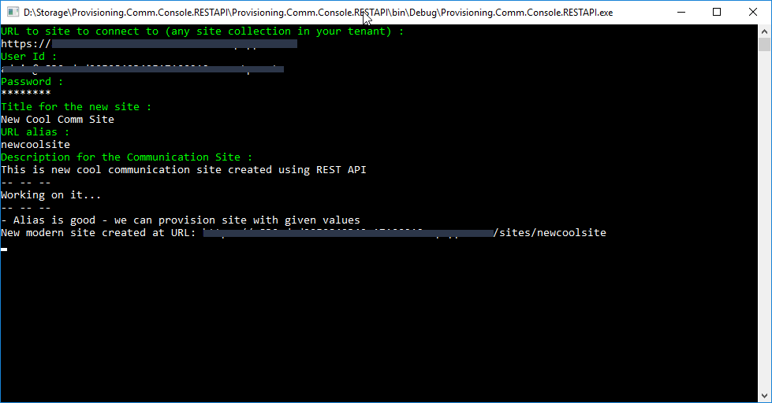

# Create a Communication Site using SharePoint REST APIs #

### Summary ###
Simple Windows Console application showing how to create Community Site with SharePoint REST APIs. Console will ask all needed details for the site creation.

More details on the used APIs can be found from following article.

* [Creating SharePoint Communication Site using REST](https://docs.microsoft.com/en-us/sharepoint/dev/apis/communication-site-creation-rest)



> Notice that the SharePoint REST API does NOT work with app-only access, so this model ONLY works in user context

### Applies to ###
-  Office 365 Multi Tenant (MT)

### Prerequisites ###
- Office 365 Tenant and permissions to sign-in

### Solution ###
Solution | Author(s)
---------|----------
Provisioning.Comm.Console.RESTAPI | Vesa Juvonen (**Microsoft**)

### Version history ###
Version  | Date | Comments
---------| -----| --------
1.0  | October 5th 2017 | Initial release

### Disclaimer ###
**THIS CODE IS PROVIDED *AS IS* WITHOUT WARRANTY OF ANY KIND, EITHER EXPRESS OR IMPLIED, INCLUDING ANY IMPLIED WARRANTIES OF FITNESS FOR A PARTICULAR PURPOSE, MERCHANTABILITY, OR NON-INFRINGEMENT.**


----------

# REST API for checking validity of alias

```
 GET /_api/GroupSiteManager/GetValidSiteUrlFromAlias?alias='aliastocheck' HTTP/1.1
```

## Response
If successful, this method returns `201, Created` response code and simple JSON object in the response body with following details.

This will return either of the following results
* Empty string - Alias cannot be used
* Full URL - Alias is good to be used

```json
{  
   "@odata.context":"https://contoso.sharepoint.com/_api/$metadata#Edm.String",
   "value":"https://contoso.sharepoint.com/sites/alias"
}
```

# REST API for creating communication site

```json
url: /_api/sitepages/communicationsite/create
method: POST
body:
{
   "request":{
      "__metadata":{
         "type":"SP.Publishing.CommunicationSiteCreationRequest"
      },
      "AllowFileSharingForGuestUsers":false,
      "Classification":"LBI",
      "Description":"Description",
      "SiteDesignId":"6142d2a0-63a5-4ba0-aede-d9fefca2c767",
      "Title":"Comm Site 1",
      "Url":"https://contoso.sharepoint.com/sites/commsite132",
      "lcid":1033
   }
}
```

## Response
If successful, this method returns `200, Success` response code and simple JSON object in the response body with following details.

```json
{
  "d":{
      "Create":{
           "__metadata":{"type":"SP.Publishing.CommunicationSiteCreationResponse"},
          "SiteStatus":2,
          "SiteUrl":"https://contoso.sharepoint.com/sites/commsite132"
      }
  }
}
```

