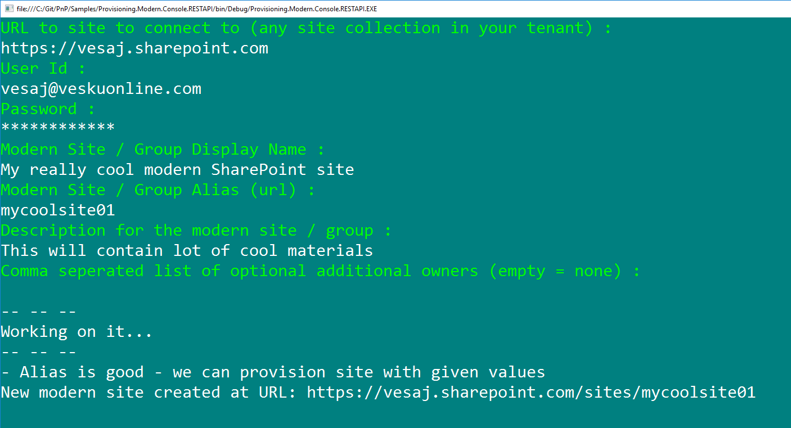

# Create a "modern" SharePoint site using SharePoint REST APIs #

### Summary ###
Simplistic Windows Console application showing how to create "modern" SharePoint sites with SharePoint REST APIs. Console will ask all needed details for the site creation. REST API calls will create a "modern" SharePoint site and associated Office 365 group for it.

Sample contains demonstrations of following scenarios
- Validate the user given alias for the modern site (used as a group alias as well) is available with SharePoint REST API. SP validation API checks status cross SharePoint, Exchange and AAD to avoid avoid conflicts on the unique URLs and alias.
- Create "modern" SharePoint by using SharePoint REST API in SharePoint context (not through AAD)



> Notice that the SharePoint REST API does NOT work with app-only access, so this model ONLY works in user context

### Applies to ###
-  Office 365 Multi Tenant (MT)

### Prerequisites ###
- Office 365 Tenant and permissions to sign-in

### Solution ###
Solution | Author(s)
---------|----------
Provisioning.Modern.Console.RESTAPI | Vesa Juvonen (**Microsoft**)

### Version history ###
Version  | Date | Comments
---------| -----| --------
1.0  | March 10th 2017 | Initial release

### Disclaimer ###
**THIS CODE IS PROVIDED *AS IS* WITHOUT WARRANTY OF ANY KIND, EITHER EXPRESS OR IMPLIED, INCLUDING ANY IMPLIED WARRANTIES OF FITNESS FOR A PARTICULAR PURPOSE, MERCHANTABILITY, OR NON-INFRINGEMENT.**


----------

# REST API for checking validity of alias

```
 GET /_api/GroupSiteManager/GetValidSiteUrlFromAlias?alias='aliastocheck' HTTP/1.1
```

## Response
If successful, this method returns `201, Created` response code and simple JSON object in the response body with following details.

This will return either of the following results
* Empty string - Alias cannot be used
* Full URL - Alias is good to be used

```
{  
   "@odata.context":"https://contoso.sharepoint.com/_api/$metadata#Edm.String",
   "value":"https://contoso.sharepoint.com/sites/alias"
}
```

# REST API for creating modern SharePoint site

```
 POST /_api/GroupSiteManager/CreateGroupEx HTTP/1.1

 {  
   "displayName":"Site Display name",
   "alias":"alias",
   "isPublic":true,
   "optionalParams":{  
      "Description":"Description for my group",
      "Owners":[  
         "emailaddress@contoso.com",
         "emailaddress@contoso.com"
      ]
   }
}
```

## Response
If successful, this method returns `201, Created` response code and simple JSON object in the response body with following details.

```
{  
   "@odata.context":"https://contoso.sharepoint.com/_api/$metadata#Microsoft.SharePoint.Portal.GroupSiteInfo",
   "DocumentsUrl":null,
   "ErrorMessage":null,
   "GroupId":"e137c7c9-3616-448d-9ffb-44014a13759e",
   "SiteStatus":2,
   "SiteUrl":"https://contoso.sharepoint.com/sites/alias"
}
```

