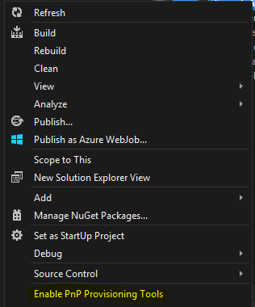
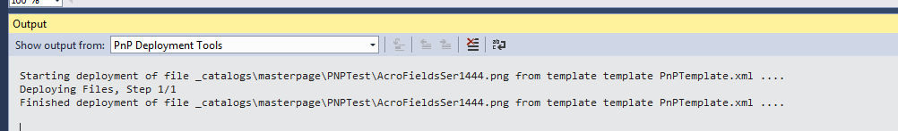
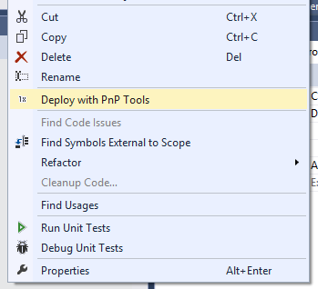

# Provisioning.VSTools #

### Summary ###
This sample demonstrates using the PnP provisioning engine within a Visual Studio extension package to assist with common deployment tasks for SharePoint assets.  The VSTools extension package maintains the PnP provisioning engine XML file automatically as files are added or removed from the project instead of the developer having to fill out the file manually which usually results in missing items, misspelled items, etc.  In addition to the XML file, the extension package also provides some useful developer shortcuts such as right click to quickly deploy a file (rather than all items in the XML file) and right click to quickly deploy the entire provisioning template.  The PnP provisioning engine XML file is fully supported (ie: content types, site columns, etc.) and deployable however the extension package only maintains file references within this XML file at this time.

### Applies to ###
-  Office 365 Multi Tenant (MT)
-  Office 365 Dedicated (D)

### Prerequisites ###
Visual Studio SDK – this is a beta version of the extension package and requires the SDK to properly install.
Note: extension packages require referenced assemblies to be signed… the PnP assemblies aren’t signed so use this in an extension package, the latest PnP Provisioning engine was downloaded, compiled, and signed.  This is important because the extension package will not auto-update if a new version of the provisioning engine is released.

### Solution ###
Solution | Author(s)
---------|----------
Provisioning.VSTools | Jerry Fetzer (Perficient, Inc.) <br>Tatjana Starovoitva (Perficient, Inc.)<br>Camille Mercado (Perficient, Inc.)<br>Michael Toole (Perficient, Inc.)


### Version history ###
Version  | Date | Comments
---------| -----| --------
0.5  | November 10th 2015| Initial beta release

### Disclaimer ###
**THIS CODE IS PROVIDED *AS IS* WITHOUT WARRANTY OF ANY KIND, EITHER EXPRESS OR IMPLIED, INCLUDING ANY IMPLIED WARRANTIES OF FITNESS FOR A PARTICULAR PURPOSE, MERCHANTABILITY, OR NON-INFRINGEMENT.**


----------

# Configuring and enabling the extension package #
Extension packages can be deployed in several ways, including VSIX package format for use with the Visual Studio Gallery and MSI deployment by creating a Setup project as part of the solution.  Extension packages can also be hosted in a private gallery to allow for controlled distribution of the extension and ease of installation and updates in Visual Studio via the Extension and Updates Tool menu item.  We chose the private gallery deployment for the easy install and easy updates when the package changes.  The process of hosting in a private gallery is described in the following blog post http://blogs.msdn.com/b/visualstudio/archive/2011/10/03/private-extension-galleries-for-the-enterprise.aspx (note: the post references Visual Studio 2010, but the same process is used for new versions of Visual Studio).

One item that was required in the web.config file of the private gallery website, that wasn’t mentioned in the blog, was to add the following MIME map for the VSIX file extension:
```XML
  <system.webServer>
    <staticContent>
      <mimeMap fileExtension=".vsix" mimeType="application/octet-stream" />
    </staticContent>
  </system.webServer> 
```
Once the VSIX package is hosted and available in Visual Studio, it can be installed from the Extension and Updates Tool menu item.  Once installed, the package functionality can be turned on or off by either right mouse clicking your project and selecting Enable PnP Provisioning Tools 



Enabling Provisioning tools creates "ProvisioningTemplateTools.config" file in the root of the project. 

You will need to fill in the login information to your Office365 site as well as information about your provisioning templates:

- Deployment
	- TargetSite: Enter URL of Office 365 site you are using for development (required for right-click -> deploy)
	- Authentication: Enter your username/password for the entered site (required for right-click -> deploy)
- Templates - add your provisioning templates 
	- Template
		- Path: Project-relative path to ypur template.xml file
		- ResourcesFolder: Project-relative path to folder that will contain files specified in template

```XML
<?xml version="1.0" encoding="utf-8"?>
<ProvisioningTemplateToolsConfiguration xmlns:xsi="http://www.w3.org/2001/XMLSchema-instance" xmlns:xsd="http://www.w3.org/2001/XMLSchema">
  <ToolsEnabled>true</ToolsEnabled>
  <Deployment>
    <TargetSite>https://{yourtenant}.sharepoint.com/sites/{yourtargetsite}/</TargetSite>
    <Authentication
      Type="Office365">
      <Office365>
        <Username>{your_office365_username}</Username>
        <Password>{your_office365_password}</Password>
      </Office365>
    </Authentication>
  </Deployment>
  <Templates>
    <Template
      Path="{path to your PnPTemplate.xml}"
      ResourcesFolder="{path to the folder containing PnP resources}" />
  </Templates>
</ProvisioningTemplateToolsConfiguration>
```

You can disable/enable tools at any point by right-clicking on the project in Solution explorer and Selecting "Enable/Disable PnP Provisioning Tools".
Alternatively you can set the ToolEnabled element in the ProvisioningTemplateToolsConfiguration.xml file to “true/false”.


# Working with Files and Folders #

Provisioning.VSTools supports synchronization of files included in template.xml with files inside dedicated resources folder. This way you can add/remove/rename files inside Template Resources folder and template.xml will be updated automatically to reflect the changes.

Provisioning.VSTools assumes the convention, that files inside Template Resources folder will follow SharePoint files structure. 
E.g. if file is supported to be deployed to "_catalogs/masterpage", it should be put inside {Template Resources Folder}\_catalogs\masterpage folder.

# Deploying to SharePoint #

**Prerequisites**: make sure you specified target site and credentials in ProvisioningTemplateTools.config file.

Monitoring progress: VSTools adds own pane to the "Output" tool window (View -> Output) called "PnP Deployment Tools". All notifications about file synchronization and deployments are displayed in this pane.



## Deploying single file ##

- Make sure file is located under {Template Resources Folder}
- Right-click file and select "Deploy with PnP Tools"



- Wait until deployment completes. You can monitor progress in "Output window" -> "PnP deployment Tools" pane

## Deploying single folder ##

- Make sure folder is located under {Template Resources Folder}
- Right-click folder and select "Deploy with PnP Tools"
- Wait until deployment completes. You can monitor progress in "Output window" -> "PnP deployment Tools" pane


## Deploying whole provisioning template ##

- Make sure template is listed in ProvisioningTemplateTools.config file
- Right-click template xml file and select "Deploy with PnP Tools"
- Wait until deployment completes. You can monitor progress in "Output window" -> "PnP deployment Tools" pane

