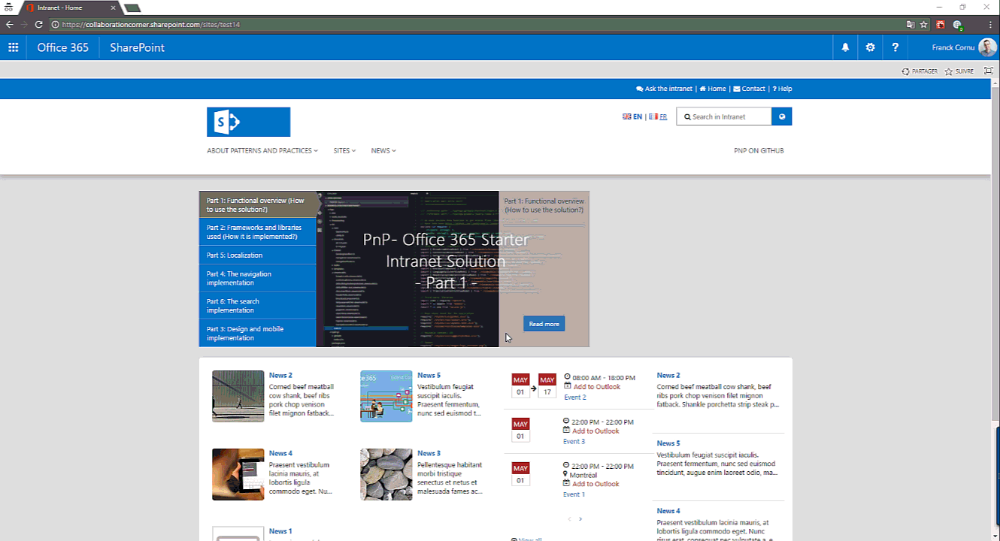

# PnP Starter Intranet for SharePoint 2013/2016 and SharePoint Online  #

### Summary ###

Intranet projects shouldn’t have to reinvent the wheel every time for basic features (like navigation or multilingualism).
This solution provides the fundamental building blocks of a common publishing intranet solution with SharePoint 2013/2016 on-premises and SharePoint Online through a lightweight client side solution and using the latest web stack development tools and frameworks.
This solution leverages the SharePoint classic publishing infrastructure feature.

Here is what you get with this sample:
- A basic page creation experience with common layouts for static page, home page and news.
- Common intranet navigation menus like main menu, header links, footer, contextual menu and breadcrumb based on taxonomy.
- A basic translation system for multilingual sites (pages and UI).
- A search experience including results with preview.
- A mobile intranet using SharePoint 2013/2016 on-premises or SharePoint Online.
- A concrete example of a bot integration within an intranet solution (see below)

<table style="margin: 0px auto;">
  <tr>
    <th>
        <p align="center">Home Page - (SharePoint Online)</p>
        <p align="center">
            
        </p>
    </th>
  </tr>
</table>

<table style="margin: 0px auto;">
  <tr>
    <th>
      <p align="center">News page (Desktop)</p>
      <p align="center">
        
      </p>
    </th>
    <th>
      <p align="center">News page (Mobile)</p>
      <p align="center">
        
      </p>
    </th>
  </tr> 
</table>

<table style="margin: 0px auto;">
  <tr>
    <th>
      <p align="center">Bot framework integration</p>
      <p align="center">
        
      </p>
    </th>
  </tr>
</table>

This solution is implemented using:

- TypeScript (for the code structure and definitions)
- Webpack (for application bundling and packaging)
- PnP JS Core library (for REST communications with SharePoint)
- PnP Remote Provisioning engine and PnP PowerShell cmdlets (for SharePoint site configuration and artefacts provisioning)
- Knockout JS (for application behavior and UI components)
- Bootstrap (for mobile support)
- Node JS (for dependencies management with npm)
- Bootstrap & Font Awesome(for overall branding)

The entire solution is "site collection self-contained" to not conflict with the global tenant/farm configuration (especially taxonomy and search configuration). It allows you to deploy this solution safely in your farm.

### Applies to ###
- SharePoint 2013/2016 on-premises
- SharePoint Online (Office 365 E3 Plan at least to get the CSWP)

### Set up your environment ###

Before starting, you'll need to setup tour environment:

- Install at latest release of [PnP PowerShell cmdlets SharePointPnPPowerShellXXX](https://github.com/OfficeDev/PnP-PowerShell/releases) according to your SharePoint version.
- Install Node.js on your machine https://nodejs.org/en/ (v6.10.1)
- Install the 'webpack' Node JS client (`npm i webpack -g`). This sample uses webpack v2.
- Go to the ".\app" folder and install all dependencies listed in the package.json file by running the `npm i` cmd 
- Check if everything is OK by running the "`webpack`" cmd from the ".\app" folder. You shouldn't see any errors here.
- Create a site collection with the **publishing template**.

<p align="center">
  
</p>

- Ensure your taxonomy term store has both "French" and "English" working languages selected (you need to be a term store administrator to do this).

<p align="center">
  
</p>

- For on-premises deployments, make sure the managed metadata service application is the default storage location for column specific term sets.

<p align="center">
  
</p>

### Solution ###
Solution                | Author(s)
------------------------|----------
Business.StarterIntranet | Franck Cornu (MVP Office Development at [aequos](https://www.aequos.ca)) - Twitter @FranckCornu 

### Version history ###
Version  | Date | Comments
---------| -----| --------
1.0 | August 19th 2016 | <ul style="list-style: none"><li>Initial release</li></ul>
1.1 | September 21st 2016 | <ul style="list-style: none"><li>Added carousel component + miscellaneous fixes</li></ul>
1.2 | January 31st 2016 |  <ul style="list-style: none"><li>Added the support of SharePoint 2013 and 2016 on-premises</li><li>Updated to TypeScript 2.1.5 and PnP Js Core 1.0.6</li></ul>
1.3 | May 4th 2017 | <ul style="list-style: none"><li>New design</li><li>Added the support of event pages</li><li>New display templates for news + new carousel design</li><li>Added a QnA bot integration with authentication</li><li>Bug fixes + migration to webpack 2.0 and sp-pnp-js 2.0</li></ul>

# Installation #

- Download the PnP source code as ZIP from GitHub and extract it to your destination folder
- Set up your environment as described above
- On a remote machine (basically, where PnP cmdlets are installed), start new PowerShell session as an **administrator** an call the `Deploy-Solution.ps1` script with your parameters like this:

```csharp
$UserName = "<your_username>"
$Password = "<your_password>"
$SiteUrl = "https://<your_site_collection>"

Set-Location "<your_installation_folder>"

$Script = ".\Deploy-Solution.ps1" 
& $Script -SiteUrl $SiteUrl -UserName $UserName -Password $Password -IncludeData

```
- Use the "`-Prod`" switch parameter for the `Deploy-Solution.ps1` script to use a production bundled version for the JavaScript code.
- Use the "`-IncludeData`" switch parameter to provision sample data (carousel and links).

# Post-installation steps #

## Configure column default values in the Pages library ##

After the deployment, you have to complete some manual steps in order to set up default column values for folders in the "Pages" library (the extensibilty provider has been removed). These information are used for the news and event webparts on the home page to filter archive page (the "See all" links).

Library/Folder | Column | Value
---------| -----| --------
Pages/ | Content Type | Page 
Pages/News | Content Type | News 
Pages/News | Site Map Position | News 
Pages/Events | Content Type | Event 
Pages/Events | Site Map Position | Events 
Documents/ | Content Type | Document 

## Configure the QnA bot ##

This solution demonstrates the integration with a QnA Bot to improve search capabilities for intranet users. A sample bot can be set up from this repository [https://github.com/FranckyC/SharePointBot](https://github.com/FranckyC/SharePointBot).

To enable the bot integration in the intranet:

- In the [Bot Framework portal](https://dev.botframework.com/), enable the direct line channel and generate new key:

<p align="center">
  
</p>

- In the configuration list, update the corresponding information 

<p align="center">
  
</p>

Because of the bot sample is implemented using OAuth2 specifications, it is designed to be used with SharePoint Online in prior (unless you have the correct OAuth2 configuration in your on-premise farm). 

### Disclaimer ###

THIS CODE IS PROVIDED AS IS WITHOUT WARRANTY OF ANY KIND, EITHER EXPRESS OR IMPLIED, INCLUDING ANY IMPLIED WARRANTIES OF FITNESS FOR A PARTICULAR PURPOSE, MERCHANTABILITY, OR NON-INFRINGEMENT.

----------