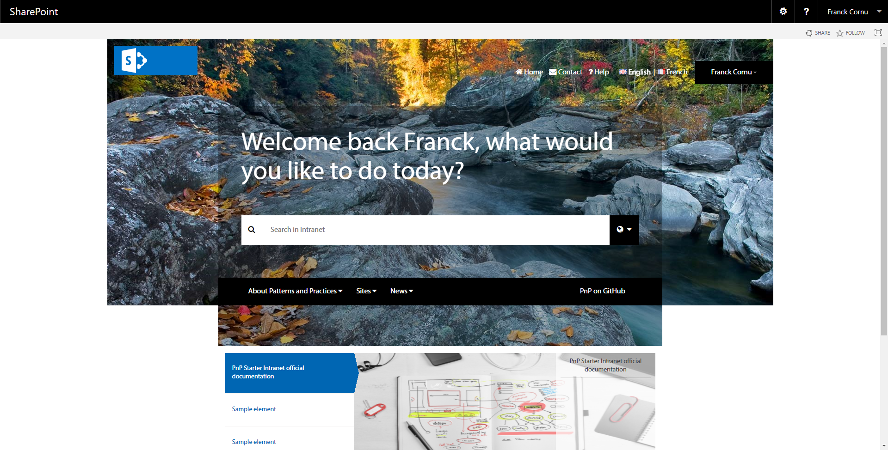
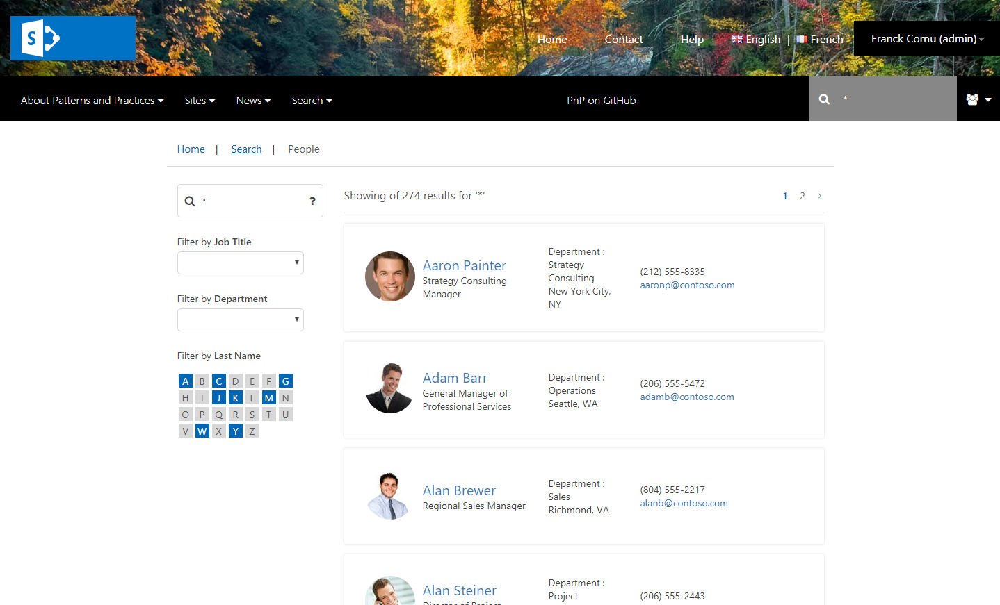
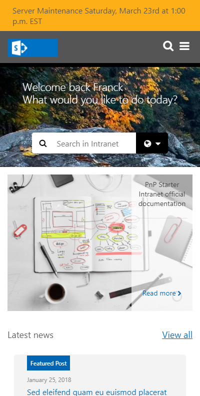
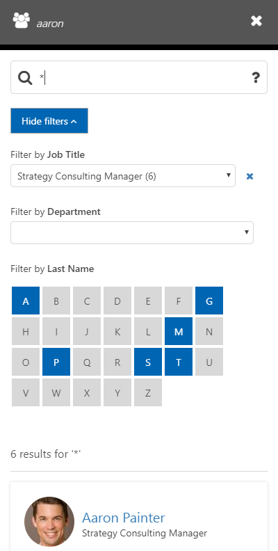
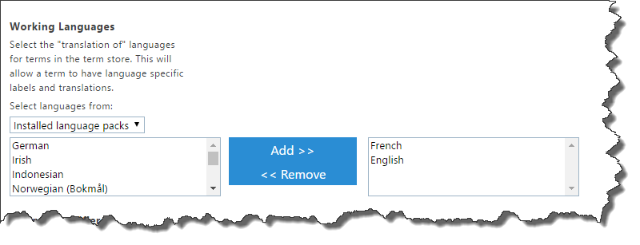
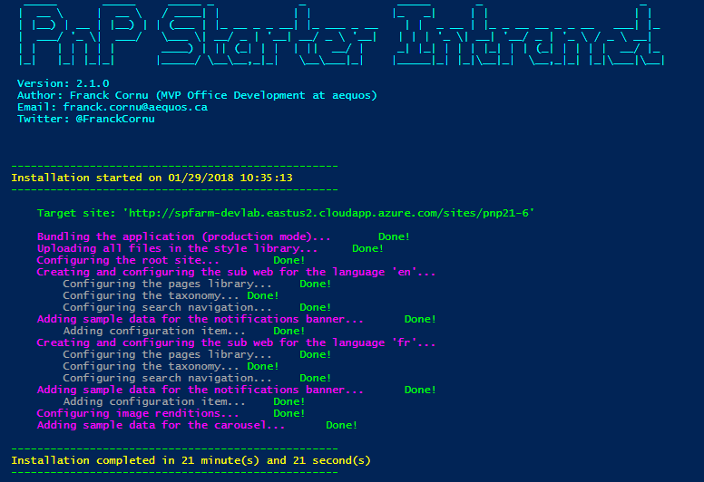
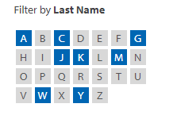
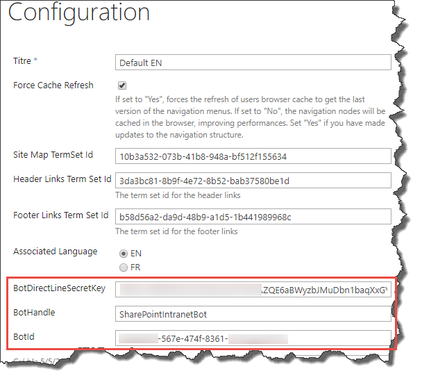

# PnP Starter Intranet for SharePoint 2013/2016 and SharePoint Online  #


## About the solution ##

<p align="center">
  
</p>

« PnP Starter Intranet » is a generic, enterprise intranet publishing solution, compatible with SharePoint 2013, 2016 and SharePoint Online and developed by aequos (www.aequos.ca). It is the direct result of hundreds of hours of work and analysis corroborated through the use of the solution in actual projects. 
Version 2.0.0’s design was created by a firm of professional graphic designers (www.wearedetour.com) in order to meet the SharePoint intranet requirements of the IDRC (International Development Research Center, www.idrc.ca).

We would therefore like to thank Denis Turgeon (Project manager at the CRDI) and Ryan Short (Founder and President of Detour UX) for having graciously agreed to share this solution with the SharePoint community. You can find the complete story behind this solution in this PnP Webcast:

[](https://youtu.be/2LQfJe8nOws)

PnP Starter Intranet is a free, open source solution that can be fully customized to meet your requirements. Inasmuch, this solution is not a product per se (and does not come with a warranty or dedicated support team), but a solid base you can use or  build on and easily customize.
Even if this solution does not meet all your requirements and development practices, it does provide, free of charge, features and capabilities that consulting firms usually charge several hundred thousands of dollars to develop.

Thank you for using the PnP Starter Intranet solution! If you have any questions or comments, please do not hesitate to send us an email at: **contact@aequos.ca**.

## Included features ##

The complete features list can be consulted [here](https://1drv.ms/x/s!AmFJcbKqkTCBiMlgqPm_efnOrwnr1w). Here is an overview of features included by default in the solution:

### Functional (overview) ###

- Complete publishing experience including static pages, news & events with prebuilt layouts and fields
  - Feature to export an event as an *ics* file
  - Ability to turn on/off comments on pages
- Multiple languages support with translation mechanism between pages
  - Ability to add new languages easily (see the official documentation)
- Complete search experience with refiners including prebuilt categories:
  - People search with alphabetical refiners
  - Document search
  - Intranet search (news, events & static pages)
- Navigation menus driven by taxonomy including a main menu with multi-columns, a left menu, the breadcrumb, a header and a footer menu.
- Prebuilt components:
  - Carousel
  - Display templates for news (tiles/list) and events (CSWP)
  - Notification banner for alerts
  - Job postings

### Non-functional (overview) ###

- Mobile devices support via responsive design
- Specific home page design
- Performance management using local storage caching techniques
- Support of SharePoint 2013, 2016 and Online with the same code base
- Bot Framework integration allowing to add an IA assistant within the portal (the bot code is not included)
- Easily expandable solution by adding new components following a common development pattern.

This solution is implemented using:

- TypeScript (for the code structure and definitions)
- Webpack (for application bundling and packaging)
- PnP JS Core library (for REST communications with SharePoint)
- PnP Remote Provisioning engine and PnP PowerShell cmdlets (for SharePoint site configuration and artefacts provisioning)
- Knockout JS (for application behaviour and UI components)
- Bootstrap (for mobile support)
- Node JS (for dependencies management with npm)
- Bootstrap & Font Awesome (for overall branding and icons)

The entire solution is "site collection self-contained" so it does not conflict with the global tenant/farm configuration (especially taxonomy and search configuration). It allows you to deploy this solution safely in your farm.

## Screenshots & Overview ##

<table border="0">
  <tr>
    <td>
      <p align="center">
        
        <p align="center">Home page</p>
      </div>
          <td>
      <p align="center">
        
        <p align="center">Search Experience</p>
      </div>
    </td>
    </td>
  </tr>
  <tr>
    <td>
      <p align="center">
        
        <p align="center">Mobile home page<p>
      </p>
    </td>
    <td>
      <p align="center">
        
        <p align="center">People search with alphabetical refiner<p>
      </p>
    </td>
  </tr>
</table>
 

## Applies to ##
- SharePoint 2013/2016 on-premises 
- SharePoint Online (*Office 365 E3* plan minimum to get the Content Search WebPart)

## Tested browsers ##

This solution is functional with the following browsers:

- Internet Explorer 10, 11
- Firefox
- Chrome
- Edge

## Solution ##
Solution                | Author(s)
------------------------|----------
Business.StarterIntranet | Franck Cornu (MVP Office Development at [aequos](https://www.aequos.ca)) - Twitter @FranckCornu 

## Version history ##
Version  | Date | Comments
---------| -----| --------
1.0 | August 19th 2016 | <ul style="list-style: none"><li>Initial release</li></ul>
1.1 | September 21st 2016 | <ul style="list-style: none"><li>Added carousel component + miscellaneous fixes</li></ul>
1.2 | January 31st 2016 |  <ul style="list-style: none"><li>Added the support of SharePoint 2013 and 2016 on-premises</li><li>Updated to TypeScript 2.1.5 and PnP Js Core 1.0.6</li></ul>
1.3 | May 4th 2017 | <ul style="list-style: none"><li>New design</li><li>Added the support of event pages</li><li>New display templates for news + new carousel design</li><li>Added a QnA bot integration with authentication</li><li>Bug fixes + migration to webpack 2.0 and sp-pnp-js 2.0</li></ul>
2.0 | August 30th 2017 | <ul style="list-style: none"><li>Completely new design reused from a real project and made by a firm of professional graphic designers</li><li>Added the option to deploy with only one language + ability to add new languages on the fly</li><li>Several performance improvements</li><li>Added a complete documentation (user and development guides) available separately</li><li>Bug fixes and code structure improvements</li></ul>
2.1 | January 30th 2018 | <ul style="list-style: none"><li>Updated the global UI experience.</li><ul style="list-style: none"><li>Improved design implementation using CSS flexboxes.</li><li>Improved mobile design.</li></ul><li>Improved search experience.<ul style="list-style: none"><li>Added an alphabetical display template refiner for people search.</li><li>Added a dropdown display template refiner.</li><li>Added a light search box.</li><li>Added a popup with search tips to help users.</li></ul></li><li>Improved the overall performance.</li><li>Updated the root logic redirection. Now we use a SharePoint redirect page to instantly redirect visitors.</li><li>Ensured compatibility with IE10, 11, Edge, Firefox and Chrome.</li><li>Added more options for deployments in the PowerShell scripts. Now we can exclude handlers form the deploymens (i.e TermGroups or Files).</li><li>Updated the "View all" link in content search display template. Now, you can set your own in the Web Part properties.</li><li>Updated the PnP provisioming template schema to 201705.</li><li>Minor bug fixes.</li></ul>
2.2 | March 11th 2018 | <ul style="list-style: none"><li>Bug fixes (Fixed news tile display template)</li><li>Added a "comments" component for pages based on the OOTB SharePoint discussion board</li><li>Updated the font awesome css version (from CDN)</li></ul>
2.2.1 | May 5th 2018 | <ul style="list-style: none"><li>Added a new option to be able to set notifications color with hexadecimal value</li><li>Fix a search box issue with Edge</li></ul>

## Solution documentation ##
 
A complete and optional documentation is available along this solution. It includes:
- A French or English version following the latest version of the solution
- A complete development guide (about 100 pages) on how to maintain and customize this solution (add a new language, create a new component, etc.)
- A complete user guide (about 40 pages) on how to use this solution from a contributor point of view (create content, manage navigation, etc.)
 
More information here: [http://thecollaborationcorner.com/2017/09/11/a-new-version-available-for-the-pnp-starter-intranet](http://thecollaborationcorner.com/2017/09/11/a-new-version-available-for-the-pnp-starter-intranet)

## Set up your environment ##

Before starting, you'll need to setup your environment:

- Install the latest release of [PnP PowerShell cmdlets SharePointPnPPowerShellXXX](https://github.com/OfficeDev/PnP-PowerShell/releases) according to your SharePoint version.
- Install Node.js on your machine https://nodejs.org/en/ *(v8.9.4)*
- Install the 'webpack' node.js client (`npm i webpack@2.4.1 -g`). This solution uses webpack v2.
- Go to the ".\app" folder and install all dependencies listed in the package.json file by running the `npm i` cmd 
- Check if everything is OK by running the "`webpack`" cmd from the ".\app" folder. You shouldn't see any errors here.
- Create a site collection with the **publishing template**.

<p align="center">
  
</p>

- Ensure your taxonomy term store has both "French" and "English" working languages selected (you need to be a term store administrator to do this).

<p align="center">
  
</p>

- For on-premises deployments, make sure the managed metadata service application is the default storage location for column specific term sets.

<p align="center">
  
</p>

## Installation ##

- Download the PnP source code as ZIP from GitHub and extract it to your destination folder
- Set up your environment as described above
- On a remote machine (basically, where PnP cmdlets are installed), start new PowerShell session as an **administrator** an call the `Deploy-Solution.ps1` script with your parameters like this:

```csharp
$UserName = "<your_username>"
$Password = "<your_password>"
$SiteUrl = "https://<your_site_collection>"

$Script = "<your_installation_folder>\Deploy-Solution.ps1" 
& $Script -SiteUrl $SiteUrl -UserName $UserName -Password $Password -IncludeData

```
- Use the "`-Prod`" switch parameter for the `Deploy-Solution.ps1` script to use a production bundled version for the JavaScript code.
- Use the "`-IncludeData`" switch parameter to provision sample data (carousel items).
- Use the "`-JsOnly`" parameter to only upload JavaScript and CSS files in the Style Library. The PnP template will not be applied.
- Use the "`-ExcludeHandlers`" parameter to exlude certain PnP handlers from the root and sub sites provisioning templates (like TermGroups, Fields, etc.).
- Use the "`-UpgradeSubSites`" parameter to force a re-application of the XML provisioning template to sub sites. 

- Estimated deployment time: **About 20 minutes** (depending your bandwidth)

<p align="center">
  
</p>

### Migrate from 2.0.0 to 2.x.x ###

If you've already install the initial version, all you need to do is to run the *Upgrade-Solution.ps1* script, like this:

```csharp
$UserName = "<your_username>"
$Password = "<your_password>"
$SiteUrl = "https://<your_site_collection>"

$Script = "<your_installation_folder>\Upgrade-Solution.ps1" 
& $Script -SiteUrl $SiteUrl -UserName $UserName -Password $Password

```

**Warning**: After the update, some Web Parts in the default pages (Home.aspx, etc.) may be duplicated. You will have to remove them manually after the upgrade. Also, the version number is persisted under the *"PnPStarterIntranetVersion"* site collection property bag key and can be reverted to 2.0.0 manually to do the upgrade again if something goes wrong.

#### Notes about the upgrade process ####

Updates are always processed for all versions as follows:
- The XML root search configuration is applied cumulatively by checking the applicable versions (greater than the current one, identified by file name convention)
- PnP provisioning templates (root and sub sites) are applied excluding the taxonomy and search settings to avoid conflicts
- Miscellaneous updates in sub site itself are done directly in the **Setup-Web.ps1** script by ensuring if a resource already exists before creating or recreating (field, list ,etc.).

By this way we are able to manage incremental updates without being too specific in scripts. 

### Multiple Languages support ###

By default, the solution comes with the support of two languages (French & English). However, you can deploy the application using just one of them. To do this, update the `Confiuguration.ps1` script file according to your requirements and start the deployment procedure as mentionned above:
```
$Languages = @(

[PSCustomObject]@{
      Title="English";
      Label="en";
      LCID=1033;
      TemplateFileName="SubSiteTemplateEN.xml";
      SearchNavigation= @(
          @{
              Title= "Intranet";
              Url="Search.aspx?icon=fa-globe"
          };
          @{
              Title= "Documents";
              Url="SearchDocuments.aspx?icon=fa-book"
          };
          @{
              Title= "People";
              Url="SearchPeople.aspx?icon=fa-users"
          };
      )
    }
)
```
## Post-installation steps ##

### Configure column default values in the Pages library ###

After the deployment, you have to complete some manual steps in order to set up default column values for folders in the "Pages" library for each language. This step is not mandatory but will help you to classify your content more easily using the pet location auto-tagging feature.

Library/Folder | Column | Value
---------| -----| --------
Pages/ | Content Type | Page 
Pages/News | Content Type | News 
Pages/News | Site Map Position | News 
Pages/Events | Content Type | Event 
Pages/Events | Site Map Position | Events 
Documents/ | Content Type | Document 

### Set permissions for contributors ###

To be able to translate pages, users must have at least the *"Add and Customize Pages"* permission (a 401 error will appear otherwise).
This permission is usually given by the built-in "Designers" SharePoint group.

### Configure search schema at global level for people last name refinement ###

If you plan to use the alphabetical display termplate for the people search, you will need to configure an existing  **RefinableStringXX** managed property targeting the *People:LastName* crawled property direclty at the  **global farm/tenant search schema level**. This configuration doesn't work if it is made at the site collection level.

<p align="center">
  
</p>

### Add comments to page ###

By default, comments are disabled for news, event and static pages. To enable them for a specific page, just turn on the *"Allow page comments"* flag when you edit the page:

<p align="center">
  
</p>

Also, by default, "Likes" are not enabled on the "Comments" list. You can enable them by setting the appropriate option in the list settings (only "Likes" work, "Ratings" aren't supported). Then, the "Write Security" setting for the discussion board list is set to *"Create items and edit items that were created by the user"* so it means user will be able to edit and delete only their own comments even if they have the *"Contribute"* permission level on the list. 

### Configure the QnA bot ###

This solution demonstrates the integration with a QnA Bot to improve search capabilities for intranet users. A sample bot can be set up from this repository [https://github.com/FranckyC/SharePointBot](https://github.com/FranckyC/SharePointBot).

To enable the bot integration in the intranet:

- In the [Bot Framework portal](https://dev.botframework.com/), enable the direct line channel and generate new key:

<p align="center">
  
</p>

- In the configuration list, update the corresponding information 

<p align="center">
  
</p>

Because of the bot sample is implemented using OAuth2 specifications, it is designed to be used with SharePoint Online in prior (unless you have the correct OAuth2 configuration in your on-premise farm). 

# IMPORTANT: Usage data gathering # 

To improve the overall solution, this application leverages the Azure Applications Insights service to collect some data about the usage. However, no confidential data is retrieved (like news and pages title and URLs). Only common metrics are tracked like the SharePoint version, browser version and so on. 

**If you don't want to send your usage data, you can simply remove the value in the "AppInsightsInstrumentationKey" column in the configuration list.**

# Troubleshooting #
If you encounter problems with the solution, please open a new issue in the PnP GitHub repository and mention `@FranckyC`.

## Disclaimer ##

THIS CODE IS PROVIDED AS IS WITHOUT WARRANTY OF ANY KIND, EITHER EXPRESS OR IMPLIED, INCLUDING ANY IMPLIED WARRANTIES OF FITNESS FOR A PARTICULAR PURPOSE, MERCHANTABILITY, OR NON-INFRINGEMENT.

----------
