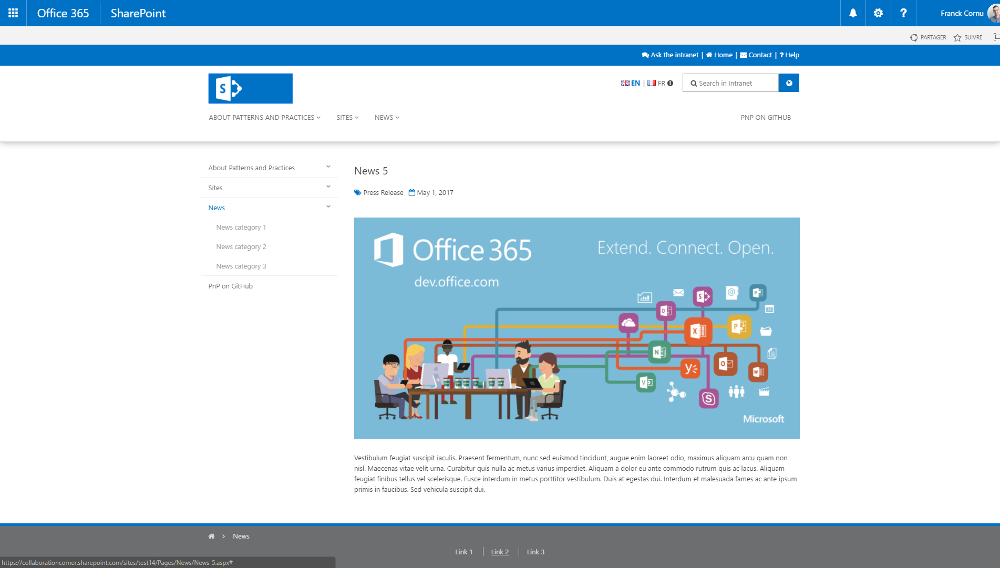
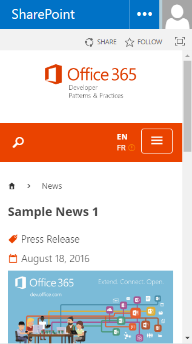
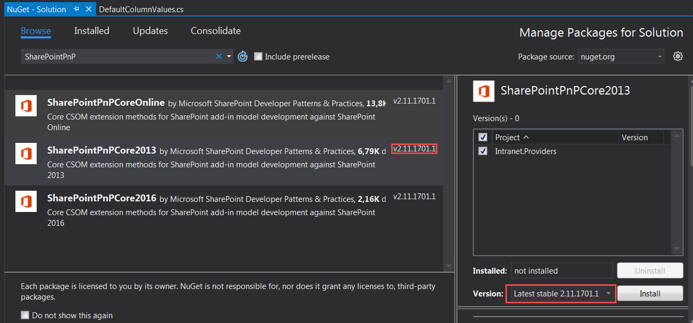

# PnP Starter Intranet for SharePoint 2013/2016 and SharePoint Online  #

### Summary ###

Intranet projects shouldn’t have to reinvent the wheel every time for basic features (like navigation or multilingualism).
This solution aims to provide the fundamental building blocks of a common intranet solution with SharePoint 2013/2016 on-premises and SharePoint Online through a lightweight client side solution using the latest web stack development tools and frameworks.
This solution leverages the SharePoint classic publishing infrastructure feature.

Here is what you get with this sample:
- A basic page creation experience with common layouts for static page, home page and news.
- Common intranet navigation menus like main menu, header links, footer, contextual menu and breadcrumb based on taxonomy.
- A basic translation system for multilingual sites (pages and UI).
- A search experience including results with preview.
- A mobile intranet using SharePoint 2013/2016 on-premises or SharePoint Online.

<table style="margin: 0px auto;">
  <tr>
    <th>
        <p align="center">Home Page - (SharePoint Online)</p>
        <p align="center">
            
        </p>
    </th>
  </tr>
</table>

<table style="margin: 0px auto;">
  <tr>
    <th>
      <p align="center">News page (Desktop)</p>
      <p align="center">
        
      </p>
    </th>
    <th>
      <p align="center">News page (Mobile)</p>
      <p align="center">
        
      </p>
    </th>
  </tr>
</table>

This solution is implemented using:

- TypeScript (for the code structure and definitions)
- Webpack (for application bundling and packaging)
- PnP JS Core library (for REST communications with SharePoint 2013)
- PnP Remote Provisioning engine and PnP PowerShell cmdlets (for SharePoint site configuration and artefacts provisioning)
- Knockout JS (for application behavior and UI components)
- Bootstrap (for mobile support)
- Office UI Fabric (for icons, fonts and styles)
- Node JS (for dependencies management with npm)

The entire solution is "site collection self-contained" to not interfer with the global tenant/farm configuration (especially taxonomy and search configuration). It allows you to deploy this solution safely in your tenant/farm.

### Documentation #

A complete documentaion is available explaining how we did this solution in details:

* [Part 1: Functional overview (How to use the solution?)](http://thecollaborationcorner.com/2016/08/22/part-1-functional-overview-how-to-use-the-solution/)
* [Part 2: Frameworks and libraries used (How it is implemented?)](http://thecollaborationcorner.com/2016/08/25/part-2-frameworks-and-libraries-used-how-it-is-implemented)
* [Part 3: Design and mobile implementation](http://thecollaborationcorner.com/2016/08/29/part-3-design-and-mobile-implementation)
* [Part 4: The navigation implementation](http://thecollaborationcorner.com/2016/08/31/part-4-the-navigation-implementation)
* [Part 5: Localization](http://thecollaborationcorner.com/2016/09/02/part-5-localization)
* [Part 6: The search implementation](http://thecollaborationcorner.com/2016/09/08/part-6-the-search-implementation)

### Applies to ###
- Office 365 Multi Tenant (MT)
- Office 365 Dedicated (D)
- SharePoint 2013 on-premises
- SharePoint 2016 on-premises

### Tested versions ###

Here are the following versions of PnP and SharePoint used for this sample:

PnP PowerShell cmdlets version (All SharePoint versions)| PnP NuGet package version (All SharePoint versions) |SharePoint 2013 tested version(s) | SharePoint 2016 tested version(s)
---------|---------|---------| ---------
<ul style="list-style: none"><li>2.11.1701.1 (January 2017)</li></ul> | <ul style="list-style: none"><li>2.11.1701.1 (January 2017)</li></ul> | <ul style="list-style: none"><li>15.0.4893.1000 (January 2017 CU)</li><li>15.0.4867.1000 (October 2016 CU)</li></ul> | <ul style="list-style: none"><li>16.0.4483.1000 (January 2017 CU)</li></ul>

### Set up your environment ###

Before starting, you'll need to setup tour environment:

- Install the latest release of [PnP PowerShell cmdlets SharePointPnPPowerShellXXX](https://github.com/OfficeDev/PnP-PowerShell/releases) according to your SharePoint version. The version must be compatible with the 201605 PnP schema version.
- For SharePoint 2016, install the [SharePoint Server 2016 Client Components SDK](https://www.microsoft.com/en-us/download/details.aspx?id=51679)
- Install Node.js on your machine https://nodejs.org/en/
- Install the 'webpack' Node JS client (`npm install webpack --global`)
- Go to the ".\app" folder and install all dependencies listed in the package.json file by running the `npm install` cmd 
- Check if everything is OK by running the "`webpack`" cmd from the ".\app" folder. You shouldn't see any errors here.
- According to the targeted SharePoint version, build the extensibility provider Visual Studio solution with the corresponding PnP NuGet package (the deployment script uses the *Debug* bin folder by default). Be careful, the PnP NuGet package version **must be the same** as the PnP PowerShell one. Before adding a new NuGet package, make sure your removed all older references (remove the old *Debug* folder as well).

<table style="margin: 0px auto;">
  <tr>
    <th>
        <p align="center">
            
        </p>
    </th>
    <th>
        <p align="center">
            
        </p>
    </th>
  </tr>
</table>

- Create a site collection with the **publishing template**.

<p align="center">
  
</p>

- Ensure your taxonomy term store has both "French" and "English" working languages selected (you need to be a term store administrator to do this).

<p align="center">
  
</p>

- For on-premises deployments, make sure the managed metadata service application is the default storage location for column specific term sets.

<p align="center">
  
</p>

### Solution ###
Solution                | Author(s)
------------------------|----------
Business.StarterIntranet | Franck Cornu (MVP Office Development)

### Version history ###
Version  | Date | Comments
---------| -----| --------
1.0 | August 19th 2016 | <ul style="list-style: none"><li>Initial release</li></ul>
1.1 | September 21st 2016 | <ul style="list-style: none"><li>Added carousel component + miscellaneous fixes</li></ul>
1.2 | January 31st 2017 |  <ul style="list-style: none"><li>Added the support of SharePoint 2013 and 2016 on-premises</li><li>Updated to TypeScript 2.1.5 and PnP Js Core 1.0.6</li></ul>

# Installation #

- Download the PnP source code as ZIP from GitHub and extract it to your destination folder
- Set up your environment as described above
- On a remote machine (basically, where PnP cmdlets are installed), start new PowerShell session as an **administrator** an call the `Deploy-Solution.ps1` script with your parameters like this:

```csharp
$UserName = "<your_username>"
$Password = "<your_password>"
$SiteUrl = "https://<your_site_collection>"

Set-Location "<your_pnp_installation_folder>\Solutions\Business.StarterIntranet"

$Script = ".\Deploy-Solution.ps1" 
& $Script -SiteUrl $SiteUrl -UserName $UserName -Password $Password -IncludeData

```
- Use the "`-Prod`" switch parameter for the `Deploy-Solution.ps1` script to use a production bundled version for the JavaScript code.
- Use the "`-IncludeData`" switch parameter to provision sample data (carousel and links).

----------

### Disclaimer ###

THIS CODE IS PROVIDED AS IS WITHOUT WARRANTY OF ANY KIND, EITHER EXPRESS OR IMPLIED, INCLUDING ANY IMPLIED WARRANTIES OF FITNESS FOR A PARTICULAR PURPOSE, MERCHANTABILITY, OR NON-INFRINGEMENT.

----------