# Office 365 Modern Provisioning with Bot, Flow, Azure Function #

## Summary ##

This sample demonstrates how to integrate a typical enterprise scenario where the user can submit a creation's request
for a new SharePoint team site, communication site or a Microsoft team through a node.js Bot (App Only) which is available on Teams, Skype, Direct line and so on.
The request is stored in a SharePoint list accessible only by an admin which can approve it, triggering a Microsoft Flow
that contains the logic necessary to send an email to the end user and the admin in order to notify that the process is started.
After that, if a request has the status equal to "Requested" the latter is processed by calling an Azure c# function that
creates a SharePoint team site, communication site or a Microsoft Team.
Microsoft Flow receives a response from the Azure function with HTTP status 200, at the end the user receives an email that notifies the end of the process.
Furthermore, there is also a SharePoint Framework Application Customizer which allows the user to interact with the Bot by leveraging the capabilities of the direct line from a SharePoint site.

[Blog post here http://www.delucagiuliano.com/office-365-modern-provisioning-with-bot-flow-azure-function-and-sharepoint-framework](http://www.delucagiuliano.com/office-365-modern-provisioning-with-bot-flow-azure-function-and-sharepoint-framework)

### When to use this pattern? ###
This sample is suitable when you want to implement a typical enterprise scenario in order to request and approving the creation of a new SharePoint site or Microsoft team. 

<p align="center">
  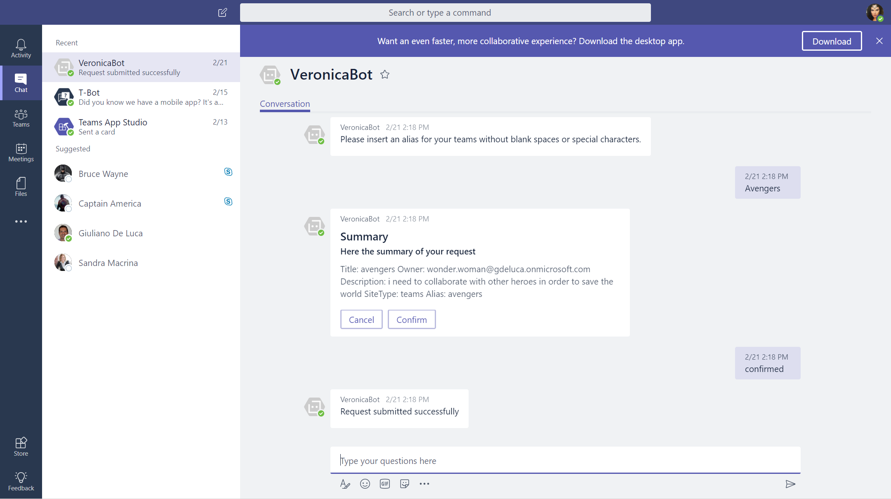
  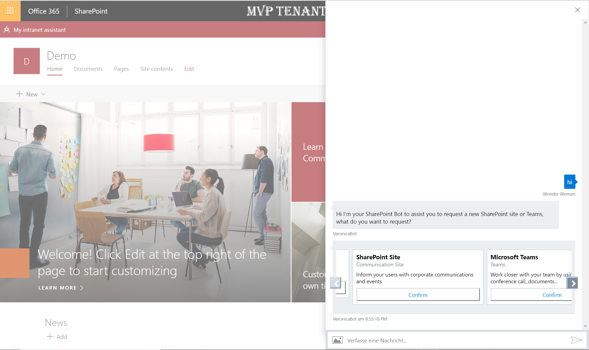
</p>

### Solution Architecture ###
<p align="center">
  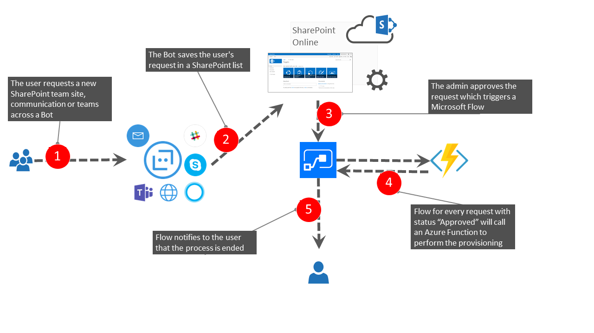
</p>

## Used SharePoint Framework Version 


## Applies to

* [SharePoint Framework](https:/dev.office.com/sharepoint)
* [Office 365 tenant](https://dev.office.com/sharepoint/docs/spfx/set-up-your-development-environment)

## Solution

Solution|Author(s)
--------|---------
O365-Modern-Provisioning | Giuliano De Luca (MVP Office Development) - Twitter @giuleon

## Version history

Version|Date|Comments
-------|----|--------
1.0 | February 19, 2018 | Initial release

## Disclaimer
**THIS CODE IS PROVIDED *AS IS* WITHOUT WARRANTY OF ANY KIND, EITHER EXPRESS OR IMPLIED, INCLUDING ANY IMPLIED WARRANTIES OF FITNESS FOR A PARTICULAR PURPOSE, MERCHANTABILITY, OR NON-INFRINGEMENT.**

---

## Minimal Path to Awesome

- Clone this repository and follow the instructions below

## Prerequisites ##
 
### 1- Setup the Azure AD application ###

The Bot makes use of Microsoft Graph API (App Only), you need to register a new app in the Azure Active Directory behind your Office 365 tenant using the Azure portal:
<p align="center">
  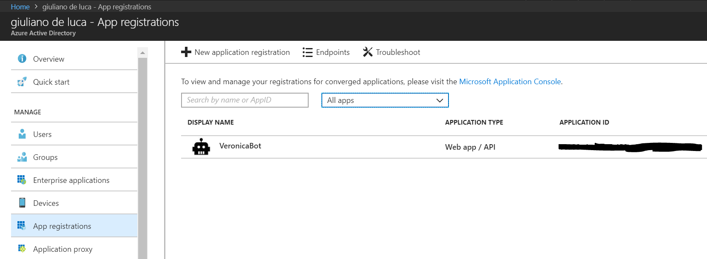
</p>

- Go to https://portal.azure.com. Log in and register a new application assigning a key secret:
<p align="center">
  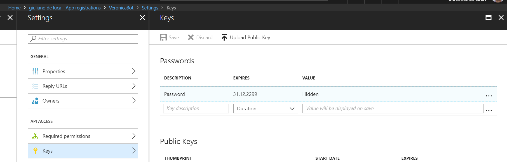
</p>

- Add the **Application Permission** for Microsoft Graph **Read and Write All Groups** and **Read and write items in all site collections**.
<p align="center">
  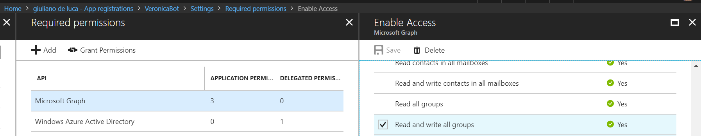
  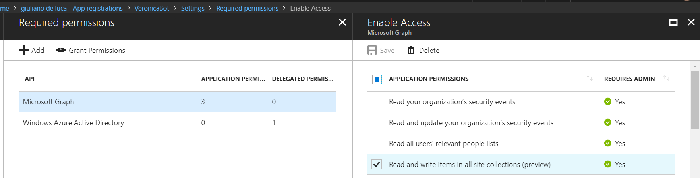
</p>

- Keep in mind that if you have to work with the user's context you will need to change the permission in **Delegated Permission** and of course you will need to change the Bot in order to handle the sign-in and redirect with the token.

### 2- Create the Node.js Bot in Azure ###

The prerequisite is an Azure subscription in order to go forward, therefore create the Azure Node.js Bot:
<p align="center">
  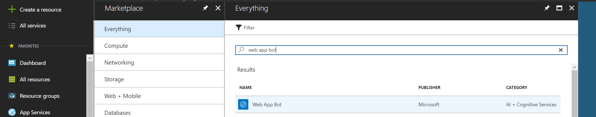
</p>

- Click on build in your Azure Bot page and after "Open online code editor"
<p align="center">
  
</p>

- Click on build in your Azure Bot page and after "Open online code editor"
<p align="center">
  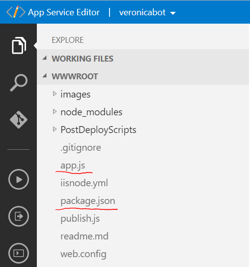
</p>

- Replace the content of the files **app.js** and **package.json** with the sample contained in **VeronicaBot** folder (app.js, package.json)

- The last step regards the configuration, remember to set up properly the variables in the Application Settings:
<p align="center">
  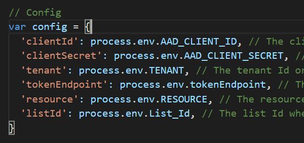
  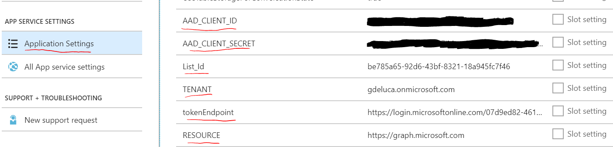
</p>

### 3- Create the SharePoint list, tenant properties and the SPFx Application Customizer ###

The Bot will cover multiple scenarios Teams, Direct Line, Skype, Cortana, Email, Slack....
However, if you plan to make use of Direct Line you can install the SPFx application customizer **react-provisioning-bot** as scope your tenant or specific site collection.

<p align="center">
  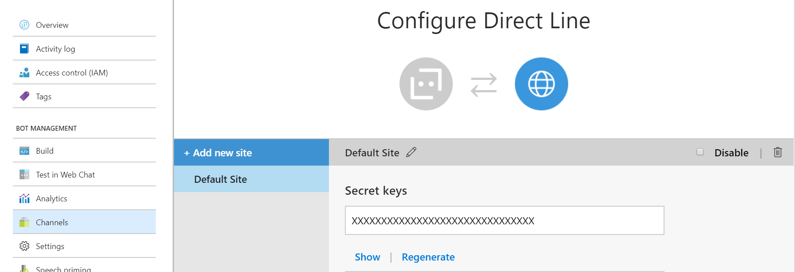
</p>

The SPFx reads the following tenant properties bag:

```typescript
  private readonly ENTITYKEY_BOTID = "PnPGraphBot_BotId";
  private readonly ENTITYKEY_DIRECTLINESECRET = "PnPGraphBot_BotDirectLineSecret";
  private readonly CONVERSATION_ID_KEY = "PnPGraphBot_ConversationId";
``` 

Therefore, you have to run the script **set-tenant-properties.ps1** in the folder **ProvisioningArtifacts** to save these properties.

There is a SharePoint list which is required in order to store the users's requests, therefore run the Powershell script **create-sharepoint-list.ps1**, if you have not installed on your machine the PnP cmdlets please [install it](https://github.com/SharePoint/PnP-PowerShell).
I suggest you install the list in the root site collection of the tenant, conceptually it make sense dedicates this site to the admins, but of course you are free to install it where you prefer.

### 4- Azure Function ###

The engine of this solution is a c# Azure Function **Modern.Provisioning.Async.Function** which makes use of PnP to create a new SharePoint site (Team or Communication) or a new Microsoft Teams according to the user's request.
Just to clarify, the Azure Function uses the admin credentials, the password is encrypted into a [Azure Key Vault](https://azure.microsoft.com/en-us/services/key-vault/).
In order to consume properly the Azure Function please don't forget to configure the application settings:

Key | Description
------------ | -------------
spAdminUser | tenant admin email
KeyVaultSecret | The key secret value after having created the key vault
TokenEndpoint | The token endpoint that you can retrieve from your Office 365 tenant Azure portal
listName | for this sample is **SitesRequest**
ClientId | Client Id App Only registered in order to consume Microsoft Graph and already used by the Bot
ClientSecret | Client Secret App Only registered in order to consume Microsoft Graph and already used by the Bot

- The SharePoint sites are created across PnP
- The Microsoft Teams are created with Graph

### 5- Microsoft Flow ###
Last but not least, there is a Microsoft Flow to implement, which basically performs the following steps:

- send an email to the admin when a user's request has been saved in the list **SitesRequest**
- When the admin approves the request the Azure Function is called to start the provisioning
- When the process is concluded an email notify the user that the request has been solved

<p align="center">
  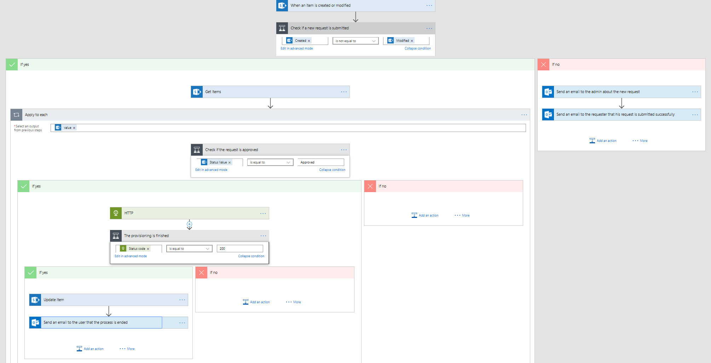
</p>

